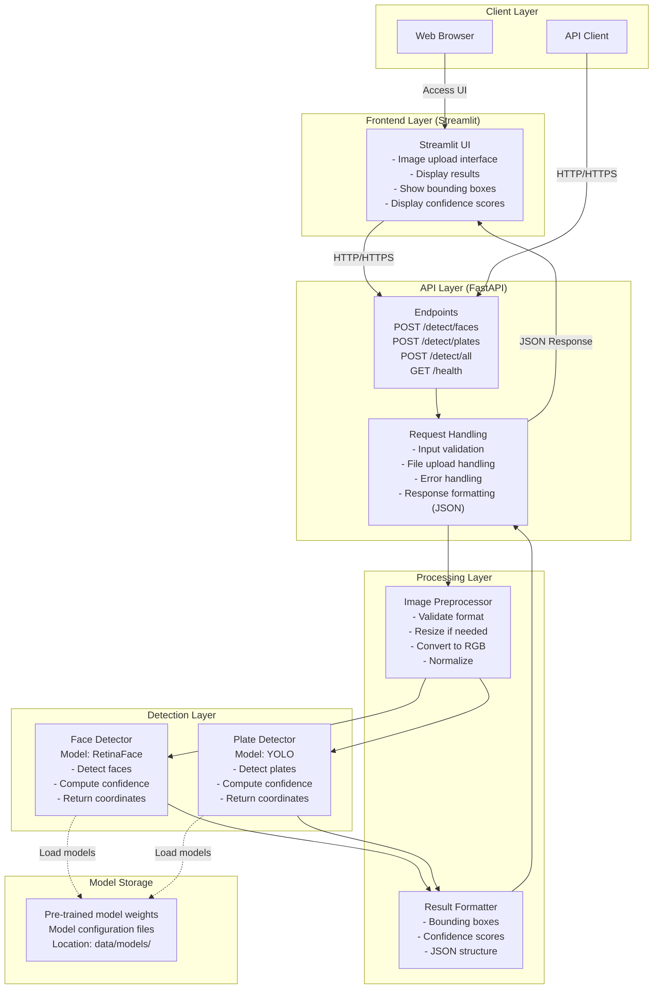
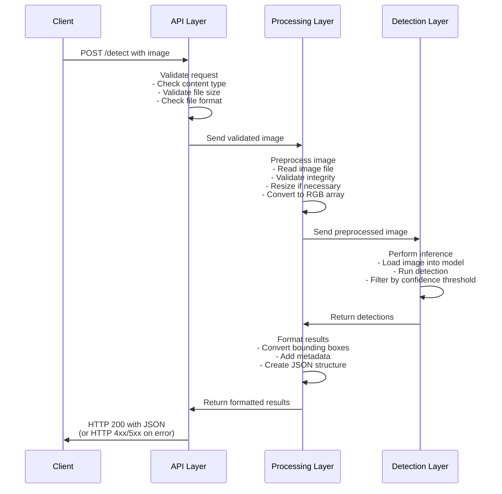
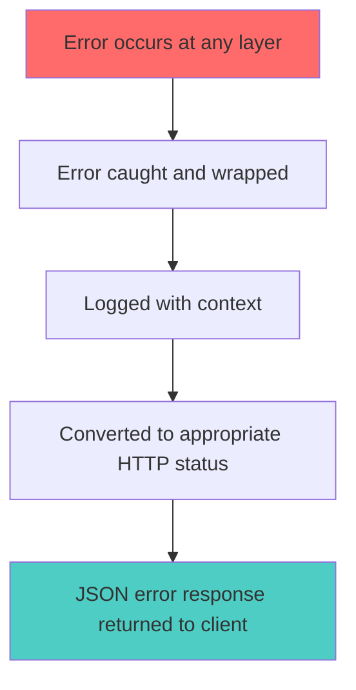

# ARCHITECTURE

## 1. System Overview

### Purpose
This document describes the technical architecture for the HTW Emerging Photo POC - a system that detects faces and license plates in images using computer vision and machine learning.

### Key Capabilities
- Face detection with bounding boxes and confidence scores
- License plate detection with bounding boxes and confidence scores
- REST API for easy integration
- Support for JPG and PNG image formats

---

## 2. Architecture Diagram



---

## 3. Component Architecture

### 3.1 Frontend Layer

**Technology**: Streamlit (Python)

**Responsibilities**:
- Provide simple web interface for users
- Handle image upload from browser
- Display uploaded images
- Call backend API endpoints
- Visualize detection results
- Show bounding boxes on images
- Display confidence scores

**Key Features**:

```python
# Streamlit UI Components
- File uploader (JPG/PNG, max 10MB)
- Image display with annotations
- Detection type selector (Faces, Plates, Both)
- Results visualization
- Error message display
```

**User Flow**:
1. User accesses Streamlit web interface
2. User uploads image via file uploader
3. User selects detection type (faces/plates/both)
4. Streamlit calls FastAPI backend
5. Results displayed with bounding boxes
6. Confidence scores shown for each detection

### 3.2 API Layer

**Technology**: FastAPI (Python)

**Responsibilities**:
- Accept HTTP requests from clients
- Validate image uploads (format, size)
- Route requests to appropriate detectors
- Format and return JSON responses
- Handle errors gracefully

**Key Endpoints**:

```python
POST /detect/faces
- Input: Image file (JPG/PNG, max 10MB)
- Output: JSON with face detections

POST /detect/plates
- Input: Image file (JPG/PNG, max 10MB)
- Output: JSON with plate detections

POST /detect/all
- Input: Image file (JPG/PNG, max 10MB)
- Output: JSON with both face and plate detections

GET /health
- Output: Service health status
```

**Response Format**:
```json
{
  "success": true,
  "processing_time": 1.23,
  "faces": [
    {
      "id": 1,
      "bbox": {"x": 100, "y": 150, "width": 80, "height": 100},
      "confidence": 0.95
    }
  ],
  "plates": [
    {
      "id": 1,
      "bbox": {"x": 200, "y": 300, "width": 120, "height": 40},
      "confidence": 0.87
    }
  ]
}
```

### 3.3 Processing Layer

**Responsibilities**:
- Preprocess images for optimal detection
- Validate image integrity
- Format detection results
- Handle coordinate transformations

**Components**:

#### Image Preprocessor
```python
class ImagePreprocessor:
    """Prepares images for detection"""
    
    def validate(image_file) -> bool:
        # Check format (JPG/PNG only)
        # Check file size (max 10MB)
        # Verify image integrity
    
    def preprocess(image) -> np.ndarray:
        # Resize if > 4096x4096
        # Convert to RGB
        # Normalize pixel values
        # Return as numpy array
```

#### Result Formatter
```python
class ResultFormatter:
    """Formats detection results as JSON"""
    
    def format_detections(faces, plates, time) -> dict:
        # Convert bounding boxes to standard format
        # Add unique IDs
        # Include confidence scores
        # Add metadata (processing time, etc.)
```

### 3.4 Detection Layer

**Responsibilities**:
- Load and manage ML models
- Perform face detection
- Perform license plate detection
- Return bounding boxes and confidence scores

**Components**:

#### Face Detector
```python
class FaceDetector:
    """Detects faces in images"""
    
    def __init__(self, model_path, confidence_threshold=0.7):
        # Load pre-trained model
        # Set confidence threshold
    
    def detect(self, image: np.ndarray) -> List[Detection]:
        # Run inference
        # Filter by confidence threshold
        # Return detections with bbox and confidence
```

**Selected Model**:
- **RetinaFace**: High accuracy face detection with facial landmarks

#### License Plate Detector
```python
class PlateDetector:
    """Detects license plates in images"""
    
    def __init__(self, model_path, confidence_threshold=0.7):
        # Load pre-trained model
        # Set confidence threshold
    
    def detect(self, image: np.ndarray) -> List[Detection]:
        # Run inference
        # Filter by confidence threshold
        # Return detections with bbox and confidence
```

**Selected Model**:
- **YOLO (v5/v8)**: Fast, accurate object detection for license plates

### 3.5 Model Storage

**Location**: `data/models/`

**Structure**:
```
data/models/
├── face_detection/
│   └── retinaface/
│       ├── weights.pth
│       └── config.json
└── plate_detection/
    └── yolo/
        ├── best.pt
        └── config.yaml
```

**Management**:
- Models downloaded during setup
- Version controlled via config files
- Loaded once at startup (singleton pattern)
- Kept in memory for performance

---

## 4. Data Flow

### 4.1 Detection Request Flow



### 4.2 Error Handling Flow



**Example Error Response:**
```json
{
  "success": false,
  "error": "Invalid image format",
  "message": "Unsupported format: .bmp. Please use JPG or PNG",
  "status_code": 400
}
```

---

## 5. Technology Stack

### Frontend
- **Framework**: Streamlit
- **Language**: Python 3.9+
- **Purpose**: Web UI for image upload and result visualization

### Backend
- **Language**: Python 3.9+
- **Web Framework**: FastAPI
- **WSGI Server**: Gunicorn
- **Image Processing**: OpenCV, Pillow
- **Numerical Computing**: NumPy
- **ML Framework**: PyTorch

### Detection Models
- **Face Detection**: RetinaFace
- **Plate Detection**: YOLO

### Development Tools
- **Testing**: pytest
- **Linting**: flake8, black
- **Type Checking**: mypy
- **API Docs**: OpenAPI/Swagger (auto-generated by FastAPI)

### Deployment
- **Containerization**: Docker
- **Environment Management**: Python venv or conda
- **Configuration**: Environment variables (.env)

---

## 6. Directory Structure

```
htw-emerging-photo/
├── src/
│   ├── __init__.py
│   ├── main.py                      # Application entry point
│   ├── frontend/
│   │   ├── __init__.py
│   │   ├── app.py                   # Streamlit application
│   │   └── components/
│   │       ├── __init__.py
│   │       ├── upload.py            # Image upload component
│   │       └── results.py           # Results visualization
│   ├── api/
│   │   ├── __init__.py
│   │   ├── app.py                   # FastAPI app initialization
│   │   ├── routes/
│   │   │   ├── __init__.py
│   │   │   ├── detection.py         # Detection endpoints
│   │   │   └── health.py            # Health check endpoint
│   │   └── models/
│   │       ├── __init__.py
│   │       ├── request.py           # Request models (Pydantic)
│   │       └── response.py          # Response models (Pydantic)
│   ├── detection/
│   │   ├── __init__.py
│   │   ├── faces/
│   │   │   ├── __init__.py
│   │   │   ├── detector.py          # Face detector class
│   │   │   └── model_loader.py      # Load face detection model
│   │   └── plates/
│   │       ├── __init__.py
│   │       ├── detector.py          # Plate detector class
│   │       └── model_loader.py      # Load plate detection model
│   ├── preprocessing/
│   │   ├── __init__.py
│   │   ├── image_processor.py       # Image preprocessing
│   │   └── validators.py            # Input validation
│   ├── postprocessing/
│   │   ├── __init__.py
│   │   └── formatter.py             # Result formatting
│   ├── utils/
│   │   ├── __init__.py
│   │   ├── config.py                # Configuration management
│   │   ├── logger.py                # Logging utilities
│   │   └── exceptions.py            # Custom exceptions
│   └── config/
│       ├── __init__.py
│       └── settings.py              # Application settings
├── tests/
│   ├── __init__.py
│   ├── unit/
│   │   ├── test_face_detector.py
│   │   ├── test_plate_detector.py
│   │   ├── test_preprocessor.py
│   │   └── test_validators.py
│   ├── integration/
│   │   ├── test_api_endpoints.py
│   │   └── test_detection_flow.py
│   └── fixtures/
│       ├── images/
│       │   ├── faces/
│       │   ├── plates/
│       │   └── edge_cases/
│       └── expected_results/
├── data/
│   ├── models/
│   │   ├── face_detection/
│   │   └── plate_detection/
│   └── samples/
│       ├── sample_face.jpg
│       └── sample_plate.jpg
├── scripts/
│   ├── download_models.py           # Download pre-trained models
│   ├── test_detection.py            # Manual testing script
│   └── benchmark.py                 # Performance benchmarking
├── docs/
│   ├── INDEX.md
│   ├── ARCHITECTURE.md              # This file
│   ├── REQUIREMENTS.md
│   ├── PROCESSES.md
│   ├── PLANNING.md
│   └── VALUE_PROPOSITION.md
├── docker/
│   ├── Dockerfile
│   └── docker-compose.yml
├── .env.example                      # Example environment variables
├── .gitignore
├── requirements.txt                  # Production dependencies
├── requirements-dev.txt              # Development dependencies
├── pytest.ini                        # Pytest configuration
├── setup.py                          # Package setup
└── README.md                         # Project documentation
```

---

## 7. Configuration Management

### Environment Variables

```bash
# Application
APP_NAME="HTW Emerging Photo"
APP_VERSION="1.0.0"
DEBUG=false
LOG_LEVEL="INFO"

# API
API_HOST="0.0.0.0"
API_PORT=8000
MAX_UPLOAD_SIZE=10485760  # 10MB in bytes

# Detection
FACE_DETECTION_MODEL="retinaface"
FACE_CONFIDENCE_THRESHOLD=0.7
PLATE_DETECTION_MODEL="yolo"
PLATE_CONFIDENCE_THRESHOLD=0.7

# Paths
MODEL_PATH="./data/models"
UPLOAD_PATH="./data/uploads"
```

### Configuration Class

```python
# src/config/settings.py
from pydantic import BaseSettings

class Settings(BaseSettings):
    app_name: str = "HTW Emerging Photo"
    debug: bool = False
    api_host: str = "0.0.0.0"
    api_port: int = 8000
    max_upload_size: int = 10485760
    
    face_model: str = "retinaface"
    face_threshold: float = 0.7
    plate_model: str = "yolo"
    plate_threshold: float = 0.7
    
    model_path: str = "./data/models"
    
    class Config:
        env_file = ".env"
```

---

## 8. Security Architecture

### Input Validation
- **File Type Validation**: Whitelist JPG and PNG only
- **File Size Validation**: Maximum 10MB
- **Image Validation**: Verify image integrity with PIL/OpenCV
- **Filename Sanitization**: Remove special characters

### API Security
- **CORS Configuration**: Restrict allowed origins
- **Rate Limiting**: Prevent abuse (optional for POC)
- **Request Size Limits**: Enforce max upload size
- **Error Messages**: Don't leak sensitive information

### Data Privacy
- **No Storage**: Don't store uploaded images by default
- **Memory Cleanup**: Clear images from memory after processing
- **Logging**: Don't log image content or PII
- **Responsible Handling**: Handle face and license plate data responsibly

### Dependency Security
- **Regular Audits**: Run `pip audit` regularly
- **Pinned Versions**: Lock dependency versions
- **Vulnerability Scanning**: Use tools like Safety

---

## 9. Performance Considerations

### Optimization Strategies

#### Model Loading
- Load models once at startup (singleton pattern)
- Keep models in memory
- Use model caching

#### Image Processing
- Resize large images before detection
- Use efficient image libraries (Pillow-SIMD)
- Batch processing (if multiple images)

#### API Performance
- Asynchronous request handling (FastAPI async)
- Connection pooling
- Response compression (gzip)

#### Asynchronous Operations
- **Asynchronous API**: All API calls use async/await pattern for non-blocking operations
- Non-blocking I/O operations
- Efficient resource utilization

---

## 10. Scalability & Deployment

### Deployment Options

#### Option 1: Single Container (POC)
```yaml
# docker-compose.yml
version: '3.8'
services:
  api:
    build: .
    ports:
      - "8000:8000"
    volumes:
      - ./data/models:/app/data/models
    environment:
      - DEBUG=false
```

#### Option 2: Scaled Deployment (Future)
- Load balancer (Nginx/Traefik)
- Multiple API instances
- Shared model storage (NFS/S3)
- Queue system (Redis/RabbitMQ)

### Horizontal Scaling
- Stateless API design
- Models loaded per instance
- No shared memory requirements

---

## 11. Monitoring & Observability

### Logging Strategy

**Log Levels**:
- **DEBUG**: Detailed diagnostic information
- **INFO**: General information (request/response)
- **WARNING**: Unexpected but handled events
- **ERROR**: Error events, but service continues
- **CRITICAL**: Service-affecting errors

**What to Log**:
- API requests (endpoint, method, status)
- Processing time per request
- Detection results (count, average confidence)
- Errors with stack traces
- System metrics (memory, CPU)

**Example Log Structure**:
```json
{
  "timestamp": "2025-10-27T10:30:45Z",
  "level": "INFO",
  "endpoint": "/detect/faces",
  "processing_time": 1.23,
  "faces_detected": 2,
  "avg_confidence": 0.92,
  "image_size": "1920x1080"
}
```

### Metrics to Track
- Request count (per endpoint)
- Response time (p50, p95, p99)
- Error rate
- Detection success rate
- Average confidence scores
- Concurrent requests

---

## 12. Error Handling

### Error Categories

#### Client Errors (4xx)
- **400 Bad Request**: Invalid image format
- **413 Payload Too Large**: File exceeds 10MB
- **422 Unprocessable Entity**: Corrupted image

#### Server Errors (5xx)
- **500 Internal Server Error**: Unexpected errors
- **503 Service Unavailable**: Model loading failed

### Error Response Format
```json
{
  "success": false,
  "error": "InvalidImageFormat",
  "message": "Unsupported format: .bmp. Please use JPG or PNG",
  "status_code": 400,
  "timestamp": "2025-10-27T10:30:45Z"
}
```

---

## 13. Future Enhancements

### Potential Architectural Changes

#### Phase 2: Enhanced Performance
- GPU acceleration support
- Model optimization (ONNX, TensorRT)
- Caching layer (Redis)
- CDN for static assets

#### Phase 3: Advanced Features
- Real-time video processing
- Batch processing API
- Webhook notifications
- Result storage and retrieval

#### Phase 4: Production Ready
- Kubernetes deployment
- Auto-scaling
- Distributed tracing (OpenTelemetry)
- Advanced monitoring (Prometheus/Grafana)

---

## 14. Design Decisions

### ADR-001: Use Streamlit for Frontend

**Date**: October 20, 2025  
**Status**: Accepted

**Context**:  
Need a user interface for image upload and visualization. Team has limited frontend expertise. POC timeline is 4 sessions.

**Decision**:  
Use Streamlit for the frontend web application.

**Consequences**:  
Rapid Python-based development without JavaScript. Built-in components for file upload and visualization. Limited customization compared to React/Vue.

**Alternatives**:  
React + FastAPI (requires frontend expertise, extends timeline), Flask templates (poor UX), Gradio (less mature).

---

### ADR-002: Use FastAPI for Backend

**Date**: October 20, 2025  
**Status**: Accepted

**Context**:  
Need REST API framework for image uploads and detection coordination. Must integrate with Python ML stack.

**Decision**:  
Use FastAPI as the backend web framework.

**Consequences**:  
Modern async support, automatic OpenAPI docs, type safety with Pydantic. Newer ecosystem than Flask/Django.

**Alternatives**:  
Flask (lacks modern features), Django REST Framework (too heavy), Express.js (different language).

---

### ADR-003: Use PyTorch for ML

**Date**: October 20, 2025  
**Status**: Accepted

**Context**:  
Need ML framework for RetinaFace and YOLO models. Must support efficient inference and debugging.

**Decision**:  
Use PyTorch as the sole ML framework because Yolo has a direct dependancy with Pytorch.

**Consequences**:  
Excellent model implementations, pythonic API, better debugging. Larger model files than TensorFlow Lite.

**Alternatives**:  
TensorFlow (complex API), ONNX Runtime (less flexible), mixed frameworks (added complexity).

---

### ADR-004: No Image Storage

**Date**: October 20, 2025  
**Status**: Accepted

**Context**:  
Images contain PII (faces, license plates). POC has no requirements for historical data analysis.

**Decision**:  
Don't store uploaded images; process in-memory and discard immediately.

**Consequences**:  
Enhanced privacy protection, reduced costs, simpler architecture. Cannot review past detections for debugging.

**Alternatives**:  
Temporary storage (privacy risks), opt-in storage (legal complexity), anonymized storage (difficult to guarantee).

---

### ADR-005: Use Pre-trained Models

**Date**: October 20, 2025  
**Status**: Accepted

**Context**:  
4-session POC timeline. No labeled training data available. Limited GPU resources.

**Decision**:  
Use pre-trained RetinaFace and YOLO models without custom training.

**Consequences**:  
Faster development, proven accuracy, no training infrastructure needed. May not be optimized for specific use case.

**Alternatives**:  
Transfer learning (needs labeled data), custom training (4-8 sessions), fine-tuning (still needs infrastructure).

---

### ADR-006: Synchronous Processing

**Date**: October 20, 2025  
**Status**: Accepted

**Context**:  
Expected POC load <10 concurrent users. Processing time 1-2 seconds. Streamlit works best with synchronous responses.

**Decision**:  
Process images synchronously with direct HTTP request/response.

**Consequences**:  
Simpler architecture, immediate user feedback. Cannot handle high concurrent load (>20 users).

**Alternatives**:  
Async queue (adds Redis/Celery complexity), webhooks (poor UX), streaming (complex implementation).

---

### ADR-007: RetinaFace for Faces

**Date**: October 20, 2025  
**Status**: Accepted

**Context**:  
Need ≥90% face detection accuracy. Must handle various angles and lighting conditions.

**Decision**:  
Use RetinaFace as the face detection model.

**Consequences**:  
State-of-the-art accuracy (>90%), robust detection. Slower than lighter models, larger model size (~100MB).

**Alternatives**:  
MTCNN (lower accuracy ~85%), MediaPipe (less accurate for occlusions), Dlib (slower, harder deployment).

---

### ADR-008: YOLO for Plates

**Date**: October 20, 2025  
**Status**: Accepted

**Context**:  
Need ≥85% license plate detection accuracy. Various plate sizes and angles.

**Decision**:  
Use YOLO (YOLOv5/v8) for license plate detection.

**Consequences**:  
Excellent accuracy (>85%), fast inference. General detector, not plate-specific by default.

**Alternatives**:  
OpenALPR (GPL license issues), custom CNN (requires training), template matching (low accuracy).

---

### ADR-009: Docker Deployment

**Date**: October 20, 2025  
**Status**: Accepted

**Context**:  
Complex dependencies (PyTorch, OpenCV, FastAPI, Streamlit). Need consistency across environments.

**Decision**:  
Use Docker for containerization and deployment.

**Consequences**:  
Consistent environments, easy dependency management. Larger artifacts (1-2GB), Docker learning curve.

**Alternatives**:  
Virtual env only (environment inconsistencies), Kubernetes (overkill for POC), serverless (model size limits).

---

## Appendix

### Key Interfaces

#### Detection Interface
```python
class Detector(ABC):
    """Base interface for all detectors"""
    
    @abstractmethod
    def detect(self, image: np.ndarray) -> List[Detection]:
        """Detect objects in image"""
        pass
    
    @abstractmethod
    def load_model(self, model_path: str) -> None:
        """Load detection model"""
        pass
```

#### Detection Data Model
```python
@dataclass
class Detection:
    """Represents a single detection"""
    id: int
    bbox: BoundingBox
    confidence: float
    label: str  # "face" or "plate"

@dataclass
class BoundingBox:
    """Bounding box coordinates"""
    x: int
    y: int
    width: int
    height: int
```

### Reference Architecture Patterns
- **Layered Architecture**: Clear separation of concerns
- **Dependency Injection**: Models injected into detectors
- **Strategy Pattern**: Interchangeable detection models
- **Singleton Pattern**: Model loading and caching
- **Factory Pattern**: Detector creation based on config

---

**Document Version**: 1.0  
**Last Updated**: October 20, 2025  
**Next Review**: TBD  
**Maintained By**: Development Team

