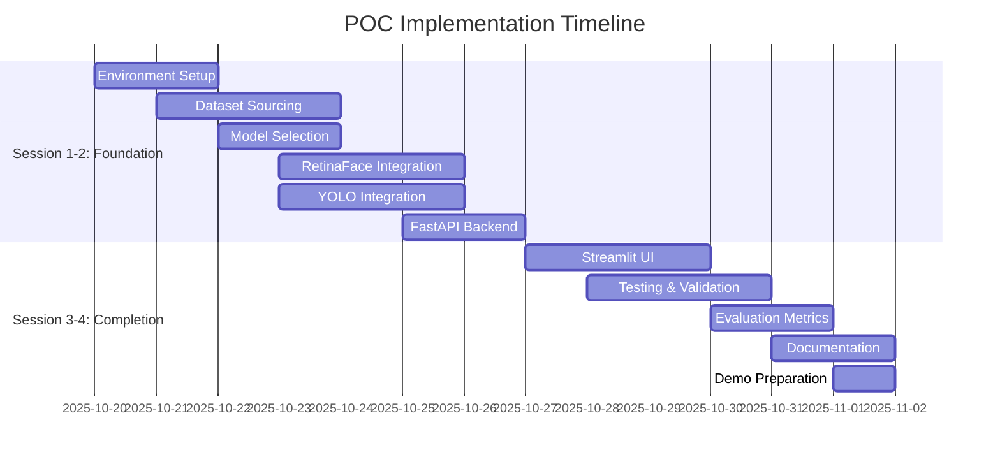
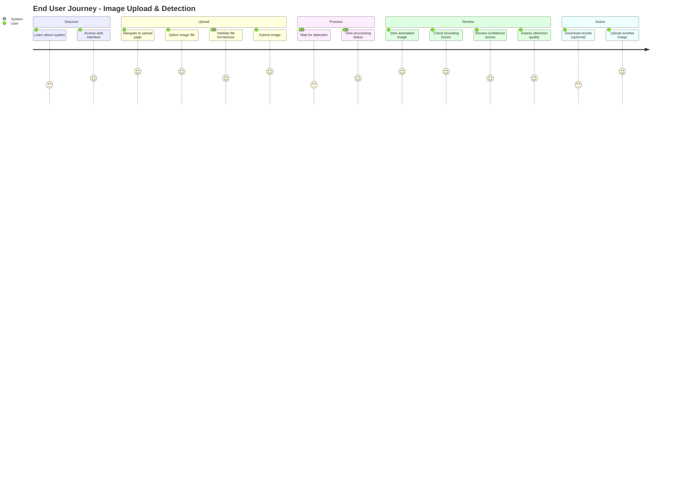

# PLANNING

## Project Information

**Project Name**: HTW Emerging Photo - Face and License Plate Detection POC  
**Start Date**: October 20, 2025  
**Duration**: 4 Sessions  
**Status**: In Progress  
**Last Updated**: October 27, 2025

---

## 1. Project Overview

### Vision
Develop an AI-powered detection system that automatically identifies and locates faces and license plates in surveillance imagery from public transport environments (bus stops, metro stations) - serving as the foundation for future privacy-preserving anonymization.

### Mission Statement
Validate the technical feasibility of automated detection using state-of-the-art models (RetinaFace, YOLO) to achieve ≥90% face detection and ≥85% license plate detection accuracy within a 4-session timeline.

### Success Definition
A working POC with:
- Face detection module (RetinaFace) achieving ≥90% accuracy
- License plate detection module (YOLO) achieving ≥85% accuracy  
- REST API for integration (FastAPI)
- Web UI for demonstration (Streamlit)
- Docker deployment
- Comprehensive evaluation (quantitative + qualitative)

---

## 2. Project Scope

### In Scope
✅ Face detection with bounding boxes and confidence scores  
✅ License plate detection with bounding boxes and confidence scores  
✅ REST API interface  
✅ Streamlit web UI for image upload and visualization  
✅ Docker containerization  
✅ Quantitative evaluation (precision, recall, F1-score)  
✅ Qualitative evaluation (visual assessment of edge cases)  

### Out of Scope
❌ Real-time video stream processing  
❌ Generative anonymization (inpainting/synthetic replacement)  
❌ Hardware optimization or edge deployment  
❌ Formal GDPR/CCPA compliance framework  
❌ Multi-camera or multi-scene scaling  
❌ Face recognition (identification of individuals)  
❌ OCR/license plate text extraction  
❌ Generation of anonymized sample video  

### Constraints
⚠️ **Timeline**: 4 sessions only  
⚠️ **Compute**: Single GPU, CPU-optimized inference preferred  
⚠️ **Data**: Publicly available datasets only  
⚠️ **Models**: Pre-trained models only (no custom training)  
⚠️ **Testing**: Manual validation (limited automation)  

---

## 3. Project Timeline

### High-Level Schedule

| Session | Focus Area | Key Deliverables |
|---------|------------|------------------|
| **Session 1** | Environment Setup & Model Research | Docker env, model evaluation, dataset sourcing |
| **Session 2** | Model Integration & API Development | RetinaFace + YOLO integrated, FastAPI skeleton |
| **Session 3** | UI Development & Testing | Streamlit UI, initial validation dataset |
| **Session 4** | Evaluation & Demo Preparation | Accuracy metrics, documentation, demo ready |

### Detailed Milestones



---

## 4. Epics and User Stories

### Epic 1: Face Detection System
**As a** security operator  
**I want** an automated face detection system  
**So that** I can identify individuals in surveillance footage without manual review

**Acceptance Criteria**:
- Face detection accuracy ≥ 90%
- Multiple faces detected in single image
- Bounding boxes and confidence scores provided
- Handles various lighting conditions and angles

#### User Stories

**US-1.1: Upload Image for Face Detection**
```
As a user
I want to upload an image file (JPG/PNG)
So that the system can detect faces in it

Acceptance Criteria:
- [ ] Supports JPG and PNG formats
- [ ] File size limit: 10MB
- [ ] Clear error message for invalid files
- [ ] Upload completes within 5 seconds

Priority: High
Estimate: 3 points
```

**US-1.2: View Detected Faces with Bounding Boxes**
```
As a user
I want to see bounding boxes around detected faces
So that I can visually verify the detection results

Acceptance Criteria:
- [ ] Bounding boxes drawn on original image
- [ ] Each box labeled with confidence score
- [ ] Visual distinction for multiple faces
- [ ] Clear, readable visualization

Priority: High
Estimate: 5 points
```

**US-1.3: Filter Face Detections by Confidence**
```
As a user
I want faces with confidence scores below 70% to be excluded
So that I only see high-confidence detections

Acceptance Criteria:
- [ ] Minimum confidence threshold: 70%
- [ ] Low-confidence detections not displayed
- [ ] Configurable threshold (future)
- [ ] Confidence displayed as percentage

Priority: Medium
Estimate: 2 points
```

**US-1.4: Handle Multiple Faces in Image**
```
As a user
I want the system to detect multiple faces in a single image
So that I can analyze group photos or crowded scenes

Acceptance Criteria:
- [ ] Detects all visible faces
- [ ] No limit on number of faces
- [ ] Each face has unique bounding box
- [ ] All confidence scores displayed

Priority: High
Estimate: 3 points
```

---

### Epic 2: License Plate Detection System
**As a** traffic analyst  
**I want** an automated license plate detection system  
**So that** I can identify vehicles in surveillance footage for traffic analysis

**Acceptance Criteria**:
- License plate detection accuracy ≥ 85%
- Multiple plates detected in single image
- Bounding boxes and confidence scores provided
- Handles various plate sizes and angles

#### User Stories

**US-2.1: Upload Image for Plate Detection**
```
As a user
I want to upload an image file (JPG/PNG)
So that the system can detect license plates in it

Acceptance Criteria:
- [ ] Supports JPG and PNG formats
- [ ] File size limit: 10MB
- [ ] Clear error message for invalid files
- [ ] Upload completes within 5 seconds

Priority: High
Estimate: 3 points
```

**US-2.2: View Detected Plates with Bounding Boxes**
```
As a user
I want to see bounding boxes around detected license plates
So that I can visually verify the detection results

Acceptance Criteria:
- [ ] Bounding boxes drawn on original image
- [ ] Each box labeled with confidence score
- [ ] Visual distinction for multiple plates
- [ ] Clear, readable visualization

Priority: High
Estimate: 5 points
```

**US-2.3: Filter Plate Detections by Confidence**
```
As a user
I want plates with confidence scores below 60% to be excluded
So that I only see high-confidence detections

Acceptance Criteria:
- [ ] Minimum confidence threshold: 60%
- [ ] Low-confidence detections not displayed
- [ ] Configurable threshold (future)
- [ ] Confidence displayed as percentage

Priority: Medium
Estimate: 2 points
```

**US-2.4: Handle Multiple Plates in Image**
```
As a user
I want the system to detect multiple license plates in a single image
So that I can analyze parking lots or multi-vehicle scenes

Acceptance Criteria:
- [ ] Detects all visible plates
- [ ] No limit on number of plates
- [ ] Each plate has unique bounding box
- [ ] All confidence scores displayed

Priority: High
Estimate: 3 points
```

---

### Epic 3: REST API Interface
**As a** developer  
**I want** a REST API for detection services  
**So that** I can integrate the detection system with other applications

**Acceptance Criteria**:
- API endpoint for image upload and detection
- JSON response with bounding boxes and confidence scores
- Proper error handling and status codes
- API documentation available

#### User Stories

**US-3.1: POST Image for Detection**
```
As a developer
I want to POST an image to /detect endpoint
So that I can receive detection results programmatically

Acceptance Criteria:
- [ ] Accepts multipart/form-data
- [ ] Processes both face and plate detection
- [ ] Returns JSON response
- [ ] Response time < 5 seconds

Priority: High
Estimate: 5 points
```

**US-3.2: Receive Structured Detection Results**
```
As a developer
I want detection results in JSON format
So that I can easily parse and use the data

Acceptance Criteria:
- [ ] JSON includes faces array with bbox + confidence
- [ ] JSON includes plates array with bbox + confidence
- [ ] Consistent response structure
- [ ] Human-readable and machine-parseable

Priority: High
Estimate: 3 points
```

**US-3.3: Handle API Errors Gracefully**
```
As a developer
I want clear error messages and status codes
So that I can handle failures appropriately

Acceptance Criteria:
- [ ] 400 for invalid file type
- [ ] 413 for oversized file (>10MB)
- [ ] 500 for server errors
- [ ] Descriptive error messages in JSON

Priority: High
Estimate: 3 points
```

**US-3.4: Access API Documentation**
```
As a developer
I want interactive API documentation
So that I can understand endpoints and test requests

Acceptance Criteria:
- [ ] FastAPI auto-generated docs at /docs
- [ ] Example requests and responses
- [ ] Parameter descriptions
- [ ] Try-it-out functionality

Priority: Medium
Estimate: 1 point
```

---

### Epic 4: Web User Interface
**As a** end user  
**I want** a simple web interface  
**So that** I can upload images and view detection results without technical knowledge

**Acceptance Criteria**:
- Streamlit-based web UI
- Image upload widget
- Visual display of detection results
- User-friendly and intuitive

#### User Stories

**US-4.1: Upload Image via Web UI**
```
As an end user
I want to upload an image using a web form
So that I can test the detection system easily

Acceptance Criteria:
- [ ] Drag-and-drop or file browser upload
- [ ] Supported formats: JPG, PNG
- [ ] File size validation (max 10MB)
- [ ] Upload progress indicator

Priority: High
Estimate: 5 points
```

**US-4.2: View Original and Annotated Images**
```
As an end user
I want to see my original image with bounding boxes overlaid
So that I can visually verify detections

Acceptance Criteria:
- [ ] Original image displayed
- [ ] Bounding boxes clearly visible
- [ ] Color-coded (faces vs plates)
- [ ] Zoomable/high-quality display

Priority: High
Estimate: 5 points
```

**US-4.3: View Detection Metadata**
```
As an end user
I want to see detection counts and confidence scores
So that I understand the detection quality

Acceptance Criteria:
- [ ] Total faces detected displayed
- [ ] Total plates detected displayed
- [ ] Confidence score per detection
- [ ] Average confidence score

Priority: Medium
Estimate: 3 points
```

**US-4.4: Receive Feedback on Errors**
```
As an end user
I want clear error messages when upload fails
So that I know what went wrong and how to fix it

Acceptance Criteria:
- [ ] Invalid file type error message
- [ ] Oversized file error message
- [ ] Network error handling
- [ ] User-friendly language

Priority: High
Estimate: 2 points
```

---

### Epic 5: Model Evaluation and Testing
**As a** data scientist  
**I want** comprehensive evaluation metrics  
**So that** I can validate the system's accuracy and performance

**Acceptance Criteria**:
- Quantitative metrics (precision, recall, F1-score)
- Qualitative assessment (edge cases, failure analysis)
- Test on diverse dataset (100+ images)
- Documented results

#### User Stories

**US-5.1: Calculate Detection Accuracy Metrics**
```
As a data scientist
I want to calculate precision, recall, and F1-score
So that I can quantify detection performance

Acceptance Criteria:
- [ ] Precision ≥ 90% for faces
- [ ] Precision ≥ 85% for plates
- [ ] Metrics calculated on test dataset (100+ images)
- [ ] Results documented in evaluation report

Priority: High
Estimate: 5 points
```

**US-5.2: Test Edge Cases and Failure Scenarios**
```
As a data scientist
I want to test challenging scenarios
So that I can identify system limitations

Acceptance Criteria:
- [ ] Poor lighting conditions tested
- [ ] Extreme angles tested
- [ ] Partial occlusion tested
- [ ] Low-resolution images tested
- [ ] Failure cases documented

Priority: High
Estimate: 5 points
```

**US-5.3: Generate Evaluation Report**
```
As a data scientist
I want a comprehensive evaluation report
So that stakeholders can review system performance

Acceptance Criteria:
- [ ] Quantitative metrics table
- [ ] Qualitative assessment section
- [ ] Sample detection visualizations
- [ ] Limitations and recommendations

Priority: Medium
Estimate: 3 points
```

---

### Epic 6: Deployment and Infrastructure
**As a** DevOps engineer  
**I want** a containerized deployment solution  
**So that** the system can be deployed consistently across environments

**Acceptance Criteria**:
- Docker container for application
- docker-compose configuration
- Environment variable configuration
- Deployment documentation

#### User Stories

**US-6.1: Create Docker Container**
```
As a DevOps engineer
I want the application packaged in a Docker container
So that it can run consistently in any environment

Acceptance Criteria:
- [ ] Dockerfile builds successfully
- [ ] All dependencies included
- [ ] Container runs without errors
- [ ] Optimized image size

Priority: High
Estimate: 5 points
```

**US-6.2: Configure Environment Variables**
```
As a DevOps engineer
I want environment-based configuration
So that I can adjust settings without code changes

Acceptance Criteria:
- [ ] Model paths configurable
- [ ] Upload size limit configurable
- [ ] API port configurable
- [ ] .env file support

Priority: Medium
Estimate: 2 points
```

**US-6.3: Document Deployment Process**
```
As a DevOps engineer
I want clear deployment instructions
So that others can deploy the system

Acceptance Criteria:
- [ ] Docker installation steps
- [ ] Build and run commands
- [ ] Troubleshooting guide
- [ ] README.md with quick start

Priority: Medium
Estimate: 3 points
```

---

### Story Mapping Summary

| Epic | Total Stories | Total Points | Priority | Session |
|------|---------------|--------------|----------|---------|
| **Epic 1: Face Detection** | 4 stories | 13 points | High | 2-3 |
| **Epic 2: Plate Detection** | 4 stories | 13 points | High | 2-3 |
| **Epic 3: REST API** | 4 stories | 12 points | High | 2 |
| **Epic 4: Web UI** | 4 stories | 15 points | High | 3 |
| **Epic 5: Evaluation** | 3 stories | 13 points | High | 4 |
| **Epic 6: Deployment** | 3 stories | 10 points | Medium | 4 |
| **Total** | **22 stories** | **76 points** | - | **1-4** |

---

## 5. User Journey Map

### Journey Overview
This journey map illustrates the complete user experience for three primary personas interacting with the face and license plate detection system.

---

### Persona 1: End User (Security Operator)
**Goal**: Upload an image and receive face/plate detection results

#### Journey Stages



| Stage | Actions | Touchpoints | Emotions | Pain Points | Opportunities |
|-------|---------|-------------|----------|-------------|---------------|
| **1. Discover** | - Access system URL<br>- View landing page<br>- Understand capabilities | - Web browser<br>- Streamlit UI | 😐 Neutral<br>Curious about functionality | - Unclear system purpose<br>- No onboarding | + Welcome message<br>+ Quick demo video |
| **2. Upload** | - Click upload button<br>- Select JPG/PNG file<br>- Confirm file < 10MB<br>- Submit for processing | - File upload widget<br>- Drag-and-drop zone<br>- Error messages | 😊 Confident<br>Easy to use | - File size limits unclear<br>- Supported formats not obvious | + Clear format labels<br>+ File size preview<br>+ Drag-and-drop support |
| **3. Process** | - Wait for detection<br>- Monitor progress<br>- System runs inference | - Progress indicator<br>- Loading spinner<br>- API backend | 😐 Neutral<br>Waiting patiently | - No progress feedback<br>- Unclear processing time | + Progress bar<br>+ Estimated time remaining |
| **4. Review** | - View original image<br>- Examine bounding boxes<br>- Read confidence scores<br>- Verify detections | - Annotated image display<br>- Detection metadata<br>- Confidence labels | 😃 Satisfied<br>Results are clear | - Small bounding boxes hard to see<br>- No zoom functionality | + Zoom/pan controls<br>+ Color-coded boxes<br>+ Highlight on hover |
| **5. Action** | - Decide next steps<br>- Upload new image<br>- Share results | - Upload button<br>- Download option | 😊 Accomplished<br>Task complete | - Can't save results<br>- No batch upload | + Export JSON results<br>+ Batch processing<br>+ History log |

---

### Key Insights

#### Pain Points
1. **Lack of Feedback**: No progress indicators during processing
2. **No Batch Processing**: Single image upload only (manual repetition)
3. **Missing Export Options**: Cannot save/share results easily
4. **Unclear Error Messages**: Generic error codes without actionable guidance
5. **Limited Zoom/Pan**: Small bounding boxes hard to see on large images

#### Positive Moments
1. **Simple Upload**: Drag-and-drop interface is intuitive
2. **Clear Visualizations**: Bounding boxes and confidence scores are helpful
3. **Fast Processing**: Results appear quickly (< 5 seconds)
4. **Accurate Detections**: High precision (90%+ faces, 85%+ plates)

#### Opportunities for Improvement (Future Phases)
1. ✅ **Batch Upload**: Process multiple images in one session
2. ✅ **Export Results**: Download JSON, CSV, or annotated images
3. ✅ **Progress Tracking**: Real-time processing status with progress bar
4. ✅ **History Log**: View past uploads and results
5. ✅ **Advanced Filtering**: Adjust confidence thresholds dynamically
6. ✅ **Zoom/Pan Controls**: Better visualization for detailed inspection
7. ✅ **Sample Images**: Pre-loaded demo images for quick testing

---

## 6. Resource Planning

### 6.1 Human Resources

| Role | Responsibility | Allocation |
|------|----------------|------------|
| **Developer** | Implementation, testing, deployment | 4 sessions (100%) |
| **Stakeholder** | Requirements review, demo feedback | Ad-hoc |

### 6.2 Technical Resources

| Resource | Purpose | Availability |
|----------|---------|--------------|
| **Single GPU** | Model inference (if needed) | Limited |
| **CPU** | Primary inference target | Available |
| **Cloud VM** | Staging/demo environment | €500/month |
| **Docker** | Containerization | Available |
| **GitHub** | Version control | Available |

### 6.3 Dataset Resources

| Dataset | Purpose | Source |
|---------|---------|--------|
| **WIDER FACE** | Face detection test data | http://shuoyang1213.me/WIDERFACE/ |
| **CelebA** | Face detection validation | http://mmlab.ie.cuhk.edu.hk/projects/CelebA.html |
| **CCPD** | Chinese City Parking Dataset (plates) | https://github.com/detectRecog/CCPD |
| **OpenALPR Dataset** | License plate samples | Community sources |
| **Custom Samples** | Edge cases, specific scenarios | Manual collection |

### 6.4 Model Resources

| Model | Purpose | Source |
|-------|---------|--------|
| **RetinaFace** | Face detection | InsightFace (GitHub) |
| **YOLOv5/v8** | License plate detection | Ultralytics (GitHub) |

---

## 7. Risk Management

### Risk Register

| ID | Risk | Probability | Impact | Mitigation Strategy | Owner |
|----|------|-------------|--------|---------------------|-------|
| **R1** | Insufficient time for integration | High | High | Focus on core features only; defer nice-to-haves | Developer |
| **R2** | Dataset quality issues | Medium | High | Use multiple dataset sources; manual curation | Developer |
| **R3** | Model accuracy below target | Low | High | Use proven pre-trained models; extensive testing | Developer |
| **R4** | GPU unavailability | Medium | Medium | Optimize for CPU inference; use smaller models | Developer |
| **R5** | Integration bugs (API-UI) | Medium | Medium | Test incrementally; allocate debug time | Developer |
| **R6** | Docker deployment issues | Low | Medium | Test early; use standard configurations | Developer |
| **R7** | Scope creep | Medium | High | Strict adherence to in-scope items; defer out-of-scope | All |

### Contingency Plans

**If accuracy targets not met**:
- Adjust confidence thresholds
- Test alternative model configurations
- Document actual performance with limitations

**If timeline slips**:
- Prioritize face detection over plate detection
- Simplify UI to basic upload/display
- Defer comprehensive documentation to post-demo

**If compute resources insufficient**:
- Use smaller model variants
- Reduce test dataset size
- Leverage cloud GPU for evaluation only

---

## 8. Communication Plan

### Stakeholder Communication

| Stakeholder | Frequency | Method | Content |
|-------------|-----------|--------|---------|
| **Project Sponsor** | Weekly | Email update | Progress, blockers, next steps |
| **Technical Reviewer** | As needed | Slack/chat | Technical questions, code review |
| **Demo Audience** | End of Session 4 | Live demo | System capabilities, results, future roadmap |

### Status Updates

**Weekly Report Template**:
- **Completed This Session**: [List tasks]
- **In Progress**: [Current work]
- **Blockers**: [Issues/risks]
- **Next Session Plan**: [Upcoming tasks]
- **Risk Status**: [Any changes to risk register]

---

## 9. Quality Assurance

### Quality Criteria

| Criterion | Target | Measurement |
|-----------|--------|-------------|
| **Face Detection Accuracy** | ≥90% precision | Test on 100+ labeled images |
| **Plate Detection Accuracy** | ≥85% precision | Test on 100+ labeled images |
| **API Response Time** | <5 seconds per image | Performance testing |
| **UI Responsiveness** | No crashes, smooth upload | Manual testing |
| **Code Quality** | Clean, documented | Code review |
| **Documentation Completeness** | All sections filled | Documentation review |

### Testing Strategy

1. **Unit Testing**: Test individual detection modules
2. **Integration Testing**: Test API-UI connection
3. **End-to-End Testing**: Full user flow (upload → detect → visualize)
4. **Performance Testing**: Process time, memory usage
5. **Edge Case Testing**: Poor quality images, extreme scenarios
6. **User Acceptance Testing**: Stakeholder demo and feedback

---

## 10. Success Metrics

### Key Performance Indicators (KPIs)

| KPI | Target | Status |
|-----|--------|--------|
| **Face Detection Precision** | ≥90% | 🔄 Pending |
| **Plate Detection Precision** | ≥85% | 🔄 Pending |
| **API Functional** | 100% uptime | 🔄 Pending |
| **UI Functional** | No critical bugs | 🔄 Pending |
| **Docker Deployable** | Successful build | 🔄 Pending |
| **Documentation Complete** | All docs reviewed | 🔄 Pending |
| **Demo Ready** | Stakeholder approved | 🔄 Pending |

### Success Criteria Checklist

- [ ] RetinaFace integrated and functional
- [ ] YOLO integrated and functional
- [ ] Face detection achieves ≥90% precision on test dataset
- [ ] License plate detection achieves ≥85% precision on test dataset
- [ ] FastAPI backend responds correctly to POST requests
- [ ] Streamlit UI allows image upload and displays results
- [ ] Bounding boxes visualized correctly on images
- [ ] Confidence scores displayed per detection
- [ ] Error handling works (invalid file, oversized file)
- [ ] Docker container builds successfully
- [ ] Docker container runs without errors
- [ ] Evaluation metrics documented (precision, recall, F1)
- [ ] All documentation files complete (ARCHITECTURE, REQUIREMENTS, PROCESSES, VALUE_PROPOSITION, PLANNING)
- [ ] Demo successfully presented to stakeholders
- [ ] Positive stakeholder feedback (≥8/10 satisfaction)

---

## 11. Dependencies

### External Dependencies

| Dependency | Type | Critical? | Mitigation |
|------------|------|-----------|------------|
| **PyTorch** | Framework | Yes | Use stable version (2.0+) |
| **RetinaFace (InsightFace)** | Model | Yes | Download pre-trained weights early |
| **YOLO (Ultralytics)** | Model | Yes | Download pre-trained weights early |
| **FastAPI** | Framework | Yes | Use stable version |
| **Streamlit** | Framework | Yes | Use stable version |
| **Docker** | Infrastructure | Yes | Ensure Docker installed early |

### Internal Dependencies

| Task | Depends On | Blocker If Delayed? |
|------|------------|---------------------|
| **API Development** | Model integration complete | Yes (critical path) |
| **UI Development** | API functional | Yes (critical path) |
| **Testing** | UI complete | Yes (critical path) |
| **Docker Deployment** | All components working | No (can defer) |
| **Documentation** | Implementation complete | No (parallel work) |

---

## 12. Session-by-Session Plan

### Session 1: Foundation & Setup
**Date**: October 20-21, 2025  
**Goal**: Environment ready, models selected, dataset sourced

**Tasks**:
1. Set up Docker development environment
2. Install Python dependencies (PyTorch, FastAPI, Streamlit)
3. Research and select models (RetinaFace, YOLO)
4. Download pre-trained model weights
5. Source test datasets (WIDER FACE, CCPD)
6. Test sample inference with both models

**Deliverables**:
- Working Docker environment
- Models successfully loaded and tested
- Test dataset prepared (100+ images)

**Risks**: Dataset quality, model download issues

---

### Session 2: Model Integration & API
**Date**: October 22-24, 2025  
**Goal**: Detection modules integrated, API functional

**Tasks**:
1. Implement RetinaFace detection module
2. Implement YOLO detection module
3. Create FastAPI application structure
4. Implement `/detect` endpoint
5. Integrate both models with API
6. Add input validation and error handling
7. Test API with curl/Postman

**Deliverables**:
- Face detection module working
- Plate detection module working
- FastAPI backend responding correctly
- JSON response formatting complete

**Risks**: Model integration bugs, API design issues

---

### Session 3: UI Development & Initial Testing
**Date**: October 25-27, 2025  
**Goal**: UI functional, initial validation complete

**Tasks**:
1. Create Streamlit application
2. Implement image upload widget
3. Connect UI to FastAPI backend
4. Visualize bounding boxes on images
5. Display confidence scores
6. Run initial validation tests
7. Identify and fix bugs

**Deliverables**:
- Streamlit UI functional
- End-to-end flow working (upload → detect → display)
- Initial accuracy assessment

**Risks**: UI-API integration issues, frontend debugging time

---

### Session 4: Evaluation, Documentation & Demo
**Date**: October 28-30, 2025  
**Goal**: Evaluation complete, demo-ready system

**Tasks**:
1. Run full evaluation on test datasets
2. Calculate precision, recall, F1-score
3. Perform qualitative assessment (edge cases)
4. Create Docker container
5. Complete all documentation
6. Prepare demo script and materials
7. Test demo flow end-to-end
8. Present demo to stakeholders

**Deliverables**:
- Quantitative evaluation report
- Qualitative assessment
- Docker container built and tested
- All documentation complete
- Successful stakeholder demo

**Risks**: Insufficient testing time, documentation rush

---

## 13. Sprint Planning

### Sprint Overview
The POC is organized as a single 4-session sprint (equivalent to 1 week) with daily sessions focused on delivering a working detection system.

---

### Sprint Goal
**Deliver a functional face and license plate detection POC with Streamlit UI, FastAPI backend, and validated accuracy metrics (≥90% faces, ≥85% plates) by end of Session 4.**

---

### Sprint Backlog

#### Sprint 1 (Sessions 1-4): Detection POC MVP

**Sprint Duration**: 4 sessions (1 week)  
**Start Date**: October 20, 2025  
**End Date**: October 27, 2025

| User Story ID | Story | Priority | Estimate | Assigned To | Status |
|---------------|-------|----------|----------|-------------|--------|
| **US-1.1** | Upload Image for Face Detection | High | 3 pts | Developer | 🔄 Pending |
| **US-1.2** | View Detected Faces with Bounding Boxes | High | 5 pts | Developer | 🔄 Pending |
| **US-1.3** | Filter Face Detections by Confidence | Medium | 2 pts | Developer | 🔄 Pending |
| **US-1.4** | Handle Multiple Faces in Image | High | 3 pts | Developer | 🔄 Pending |
| **US-2.1** | Upload Image for Plate Detection | High | 3 pts | Developer | 🔄 Pending |
| **US-2.2** | View Detected Plates with Bounding Boxes | High | 5 pts | Developer | 🔄 Pending |
| **US-2.3** | Filter Plate Detections by Confidence | Medium | 2 pts | Developer | 🔄 Pending |
| **US-2.4** | Handle Multiple Plates in Image | High | 3 pts | Developer | 🔄 Pending |
| **US-3.1** | POST Image for Detection | High | 5 pts | Developer | 🔄 Pending |
| **US-3.2** | Receive Structured Detection Results | High | 3 pts | Developer | 🔄 Pending |
| **US-3.3** | Handle API Errors Gracefully | High | 3 pts | Developer | 🔄 Pending |
| **US-3.4** | Access API Documentation | Medium | 1 pt | Developer | 🔄 Pending |
| **US-4.1** | Upload Image via Web UI | High | 5 pts | Developer | 🔄 Pending |
| **US-4.2** | View Original and Annotated Images | High | 5 pts | Developer | 🔄 Pending |
| **US-4.3** | View Detection Metadata | Medium | 3 pts | Developer | 🔄 Pending |
| **US-4.4** | Receive Feedback on Errors | High | 2 pts | Developer | 🔄 Pending |
| **US-5.1** | Calculate Detection Accuracy Metrics | High | 5 pts | Developer | 🔄 Pending |
| **US-5.2** | Test Edge Cases and Failure Scenarios | High | 5 pts | Developer | 🔄 Pending |
| **US-5.3** | Generate Evaluation Report | Medium | 3 pts | Developer | 🔄 Pending |
| **US-6.1** | Create Docker Container | High | 5 pts | Developer | 🔄 Pending |
| **US-6.2** | Configure Environment Variables | Medium | 2 pts | Developer | 🔄 Pending |
| **US-6.3** | Document Deployment Process | Medium | 3 pts | Developer | 🔄 Pending |
| **Total** | **22 stories** | - | **76 pts** | - | - |

---

### Sprint Breakdown by Session

#### Session 1 (Day 1): Foundation
**Focus**: Environment setup, model selection, dataset preparation

**Tasks**:
- [ ] Set up Docker development environment
- [ ] Install Python dependencies (PyTorch, FastAPI, Streamlit)
- [ ] Download pre-trained RetinaFace model
- [ ] Download pre-trained YOLO model
- [ ] Source test datasets (WIDER FACE, CCPD)
- [ ] Test sample inference with both models
- [ ] Organize test dataset (100+ images)

**User Stories**: Setup prerequisites for US-1.x, US-2.x  
**Velocity Target**: 0 pts (setup only)  
**Definition of Done**: Environment ready, models tested, dataset prepared

---

#### Session 2 (Day 2-3): Core Detection & API
**Focus**: Model integration, FastAPI backend development

**Tasks**:
- [ ] Integrate RetinaFace model (US-1.1, US-1.4)
- [ ] Integrate YOLO model (US-2.1, US-2.4)
- [ ] Implement image preprocessing pipeline
- [ ] Create FastAPI application structure (US-3.1)
- [ ] Implement `/detect` endpoint (US-3.1)
- [ ] Add confidence score filtering (US-1.3, US-2.3)
- [ ] Implement JSON response formatting (US-3.2)
- [ ] Add error handling (US-3.3)
- [ ] Test API with curl/Postman

**User Stories**: US-1.1, US-1.3, US-1.4, US-2.1, US-2.3, US-2.4, US-3.1, US-3.2, US-3.3  
**Velocity Target**: 27 pts  
**Definition of Done**: Face and plate detection working via API, error handling complete

---

#### Session 3 (Day 4-5): UI Development & Integration
**Focus**: Streamlit UI, end-to-end integration, initial testing

**Tasks**:
- [ ] Create Streamlit application structure (US-4.1)
- [ ] Implement image upload widget (US-4.1)
- [ ] Connect UI to FastAPI backend
- [ ] Display uploaded image
- [ ] Visualize bounding boxes on image (US-1.2, US-2.2, US-4.2)
- [ ] Display confidence scores (US-4.3)
- [ ] Add error message handling (US-4.4)
- [ ] Test end-to-end user flow
- [ ] Add FastAPI auto-documentation (US-3.4)
- [ ] Run initial validation tests

**User Stories**: US-1.2, US-2.2, US-3.4, US-4.1, US-4.2, US-4.3, US-4.4  
**Velocity Target**: 24 pts  
**Definition of Done**: UI functional, end-to-end flow working, initial tests passing

---

#### Session 4 (Day 6-7): Evaluation, Deployment & Documentation
**Focus**: Comprehensive testing, Docker deployment, documentation, demo prep

**Tasks**:
- [ ] Run face detection on test dataset (100+ images) (US-5.1)
- [ ] Run plate detection on test dataset (100+ images) (US-5.1)
- [ ] Calculate precision, recall, F1-score (US-5.1)
- [ ] Test edge cases (lighting, angles, occlusion) (US-5.2)
- [ ] Identify failure cases and document (US-5.2)
- [ ] Generate evaluation report (US-5.3)
- [ ] Create Dockerfile (US-6.1)
- [ ] Configure environment variables (US-6.2)
- [ ] Test Docker container build and run (US-6.1)
- [ ] Complete documentation (US-6.3)
- [ ] Prepare demo dataset and script

**User Stories**: US-5.1, US-5.2, US-5.3, US-6.1, US-6.2, US-6.3  
**Velocity Target**: 25 pts  
**Definition of Done**: Accuracy validated, Docker deployable, documentation complete, demo ready

---

### Sprint Velocity

| Session | Planned Points | Actual Points | Notes |
|---------|----------------|---------------|-------|
| Session 1 | 0 pts | - | Setup only |
| Session 2 | 27 pts | - | Core detection & API |
| Session 3 | 24 pts | - | UI & integration |
| Session 4 | 25 pts | - | Testing & deployment |
| **Total** | **76 pts** | **-** | To be tracked |

---

### Daily Standup Format

**Time**: Start of each session  
**Duration**: 5-10 minutes

**Questions**:
1. What did I complete in the last session?
2. What will I work on in this session?
3. Are there any blockers or risks?

**Example (Session 2)**:
- **Completed**: Environment setup, models downloaded, test dataset organized
- **Today**: Integrate RetinaFace and YOLO, build FastAPI backend
- **Blockers**: None (if GPU unavailable, will use CPU inference)

---

### Sprint Review (End of Session 4)

**Attendees**: Developer, Stakeholders, Project Sponsor  
**Duration**: 30-45 minutes

**Agenda**:
1. **Demo**: Live demonstration of detection system
   - Upload sample images via Streamlit UI
   - Show face detection results with bounding boxes
   - Show license plate detection results
   - Display confidence scores
   - Demonstrate error handling
2. **Metrics Review**: Present evaluation results
   - Face detection precision/recall
   - License plate detection precision/recall
   - Edge case performance
3. **User Stories Completed**: Review sprint backlog completion (22/22 stories)
4. **Feedback Collection**: Gather stakeholder input and questions

**Success Criteria**:
- [ ] All 22 user stories completed
- [ ] Face detection ≥90% precision
- [ ] Plate detection ≥85% precision
- [ ] Docker container deployable
- [ ] Stakeholder satisfaction ≥8/10

---

### Sprint Retrospective (End of Session 4)

**Attendees**: Developer, Technical Lead  
**Duration**: 15-20 minutes

**Questions**:
1. **What went well?**
   - [To be filled after sprint completion]
2. **What didn't go well?**
   - [To be filled after sprint completion]
3. **What can we improve in the next sprint?**
   - [To be filled after sprint completion]
4. **Action items for Phase 2**
   - [To be filled after sprint completion]

---

### Definition of Done (Sprint-Level)

A user story is considered "Done" when:
- [ ] Code is written and functional
- [ ] Unit tests pass (if applicable)
- [ ] Integration tests pass
- [ ] Code is documented (docstrings, comments)
- [ ] Feature works in Docker container
- [ ] Acceptance criteria met
- [ ] Demo-ready

The sprint is considered "Done" when:
- [ ] All high-priority user stories completed
- [ ] Accuracy targets met (≥90% faces, ≥85% plates)
- [ ] System is deployable via Docker
- [ ] Documentation is complete
- [ ] Demo successfully presented to stakeholders
- [ ] Retrospective completed

---

### Sprint Risks and Mitigation

| Risk | Likelihood | Impact | Mitigation |
|------|------------|--------|------------|
| **Velocity lower than planned** | Medium | High | Prioritize high-value stories (US-1.x, US-2.x, US-3.1, US-4.1); defer medium-priority if needed |
| **Model accuracy below target** | Low | High | Use proven pre-trained models; extensive testing; adjust confidence thresholds if needed |
| **Integration issues (API-UI)** | Medium | Medium | Test incrementally; allocate time for debugging in Session 3 |
| **Dataset quality issues** | Medium | Medium | Use multiple dataset sources; manual curation; accept lower sample size if needed |
| **Time overrun** | High | High | Focus on MVP features only; defer nice-to-haves to Phase 2 |

---

## 14. Post-POC Planning

### Immediate Next Steps (Post-Demo)
1. Gather stakeholder feedback
2. Document lessons learned
3. Identify improvements for Phase 2
4. Archive POC code and documentation

### Phase 2 Roadmap (Sessions 5-8)
- Integrate generative models (Stable Diffusion)
- Implement inpainting for face/plate replacement
- Generate anonymized sample images
- Evaluate anonymization quality (SSIM, PSNR)

### Long-Term Vision (Sessions 9+)
- Extend to video stream processing
- Optimize for real-time performance
- Explore multi-camera deployment
- Investigate selective anonymization
- Consider production deployment path

---

## 15. Lessons Learned (To Be Updated)

### What Went Well
- [To be filled after project completion]

### What Could Be Improved
- [To be filled after project completion]

### Key Takeaways
- [To be filled after project completion]

---

## 16. Approval & Sign-Off

| Role | Name | Signature | Date |
|------|------|-----------|------|
| Project Lead | [Name] | _________ | ______ |
| Technical Lead | [Name] | _________ | ______ |
| Stakeholder | [Name] | _________ | ______ |

---

## 17. Document Control

**Document Version**: 1.0  
**Created**: October 27, 2025  
**Last Updated**: October 27, 2025  
**Next Review**: End of Session 2 (October 24, 2025)  
**Owner**: Development Team

### Version History

| Version | Date | Author | Changes |
|---------|------|--------|---------|
| 1.0 | October 27, 2025 | Development Team | Initial planning document |
| | | | |

---

## 18. References

### Related Documentation
- [VALUE_PROPOSITION.md](./VALUE_PROPOSITION.md) - Project value and business case
- [REQUIREMENTS.md](./REQUIREMENTS.md) - Functional and non-functional requirements
- [ARCHITECTURE.md](./ARCHITECTURE.md) - System architecture and design decisions
- [PROCESSES.md](./PROCESSES.md) - Development processes and workflows

### External Resources
- [RetinaFace Paper](https://arxiv.org/abs/1905.00641)
- [YOLO Documentation](https://docs.ultralytics.com/)
- [FastAPI Documentation](https://fastapi.tiangolo.com/)
- [Streamlit Documentation](https://docs.streamlit.io/)
- [Docker Documentation](https://docs.docker.com/)

---

**Status**: 🔄 In Progress  
**Current Session**: 1 of 4  
**Completion**: 0%

