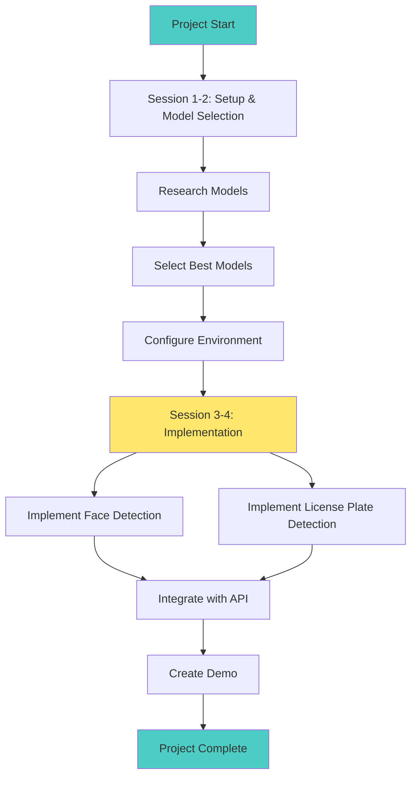
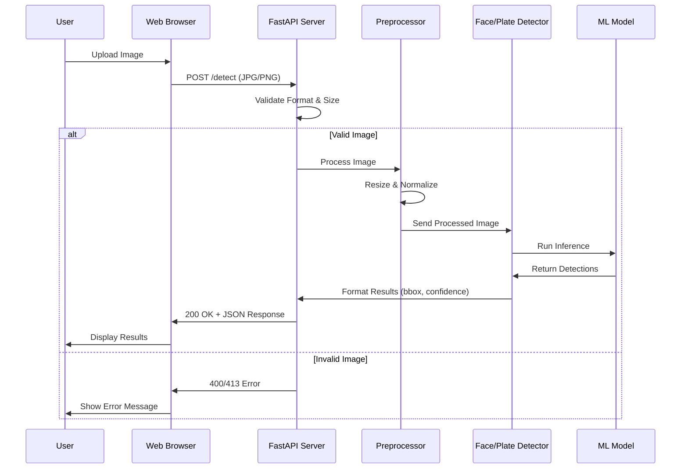
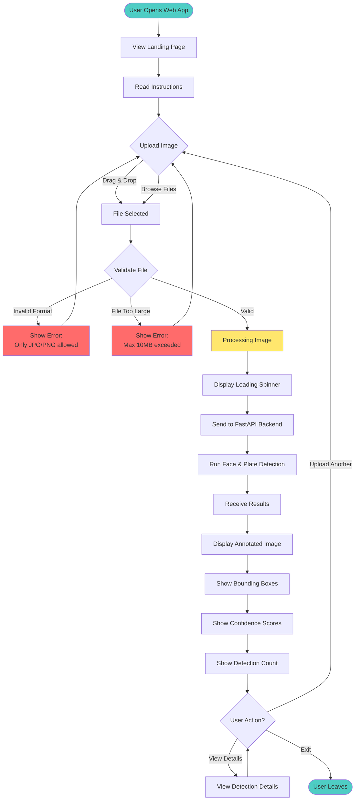
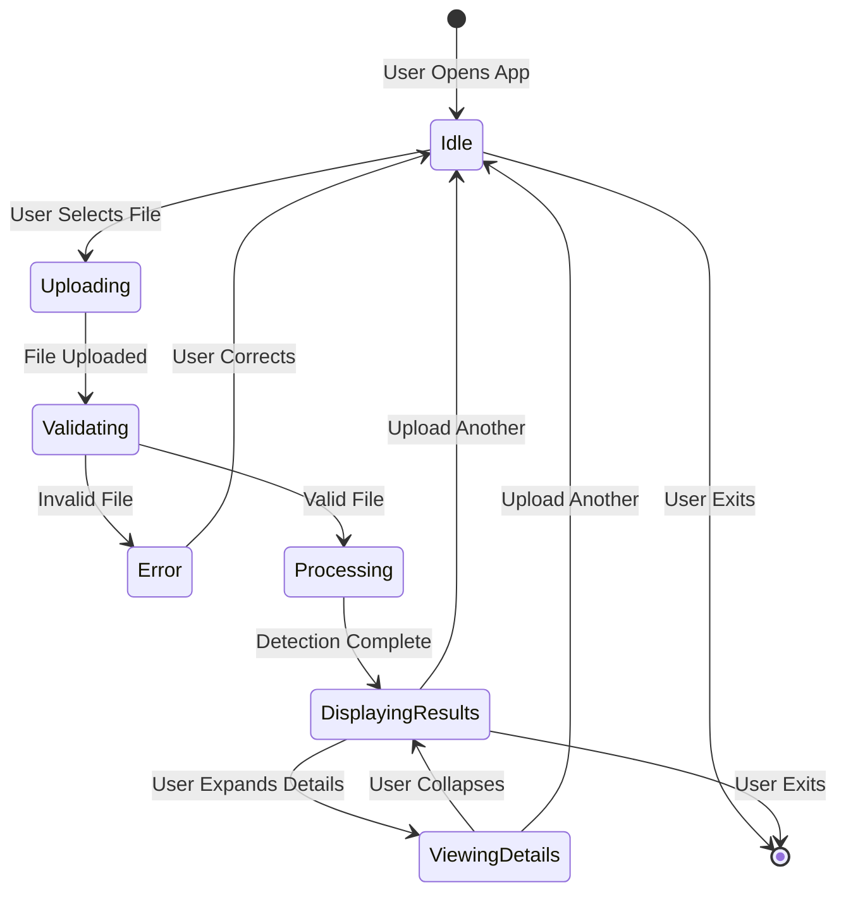

# PROCESSES

## 1. Project Overview

### Purpose
Proof of Concept (POC) to demonstrate automated face detection and license plate detection from images.

### Objectives
- [ ] Implement face detection from images with confidence scores
- [ ] Implement license plate detection
- [ ] Achieve >90% detection accuracy on test dataset
- [ ] Support JPG and PNG image formats

### Success Criteria
- [ ] Face detection accuracy ≥ 90%
- [ ] License plate detection accuracy ≥ 85%
- [ ] Working demo with sample images

### Timeline
- **Start Date**: October 20, 2025
- **Expected Completion**: 4 sessions
- **Milestones**:
  - Session 1-2: Setup and model selection
  - Session 3-4: Face and license plate detection implementation

---

## 2. Process Diagrams

### 2.1 Development Process Flow



### 2.2 Detection Request Sequence



---

## 3. User Flow Interaction

### Overview
This section describes the end-to-end user interaction flow for the face and license plate detection system via the Streamlit web interface.

---

### 3.1 User Flow Diagram



---

### 3.2 Detailed User Flow Steps

#### Step 1: Access Application
**User Action**: Opens web browser and navigates to application URL  
**System Response**: Displays Streamlit landing page with title and instructions  
**UI Elements**: 
- Application title: "Face & License Plate Detection"
- Brief description of functionality
- File upload widget

---

#### Step 2: Upload Image
**User Action**: Uploads an image file  
**Methods**: 
- Drag and drop image file into upload area
- Click "Browse files" and select from file system

**Supported Formats**: JPG, PNG  
**File Size Limit**: Maximum 10MB

**UI Elements**:
- File upload widget with drag-and-drop zone
- "Browse files" button
- File format and size information

---

#### Step 3: File Validation
**System Action**: Validates uploaded file  

**Validation Checks**:
- ✅ File format is JPG or PNG
- ✅ File size is ≤ 10MB
- ✅ File is a valid image (can be opened)

**Success Path**: Proceed to processing  
**Error Path**: Display error message and prompt for new upload

**Error Messages**:
- "❌ Invalid file format. Please upload JPG or PNG images only."
- "❌ File size exceeds 10MB limit. Please upload a smaller image."
- "❌ Invalid image file. Please upload a valid image."

---

#### Step 4: Processing
**System Action**: Sends image to FastAPI backend for detection  

**User Experience**:
- Loading spinner displayed
- Status message: "🔄 Processing image..."
- UI elements disabled during processing

**Backend Process**:
1. Receives image via POST to `/detect` endpoint
2. Preprocesses image (resize, normalize)
3. Runs RetinaFace for face detection
4. Runs YOLO for license plate detection
5. Formats results as JSON
6. Returns response to frontend

**Processing Time**: < 5 seconds (typical)

---

#### Step 5: Display Results
**System Action**: Renders detection results  

**Visual Display**:
- **Original Image**: Displayed with bounding boxes overlaid
- **Face Bounding Boxes**: Green rectangles around detected faces
- **Plate Bounding Boxes**: Blue rectangles around detected plates
- **Confidence Scores**: Percentage labels on each bounding box

**Metadata Display**:
- Total faces detected: `X faces found`
- Total plates detected: `Y plates found`
- Average confidence: `Z%`

**UI Layout**:
```
┌─────────────────────────────────────┐
│  Annotated Image                    │
│  (with bounding boxes)              │
└─────────────────────────────────────┘

📊 Detection Results:
   - Faces Detected: 3
   - Plates Detected: 1
   - Avg Confidence: 87%

┌─────────────────────────────────────┐
│  Detection Details:                 │
│  Face 1: 94% confidence             │
│  Face 2: 89% confidence             │
│  Face 3: 81% confidence             │
│  Plate 1: 92% confidence            │
└─────────────────────────────────────┘
```

---

#### Step 6: User Actions
**Available Actions**:

1. **Upload Another Image**
   - Click "Upload another image" button
   - Returns to Step 2

2. **View Detection Details**
   - Expand details section
   - View individual detection coordinates
   - View confidence scores per detection

3. **Exit Application**
   - Close browser tab
   - Session data cleared (no image stored)

---

### 3.3 User Interaction States



---

### 3.4 Error Handling Flow

**Error Scenarios**:

| Error Type | Trigger | User Message | Recovery Action |
|------------|---------|--------------|-----------------|
| **Invalid Format** | User uploads non-JPG/PNG file | "Only JPG and PNG formats supported" | Prompt to select different file |
| **File Too Large** | User uploads file > 10MB | "File size exceeds 10MB limit" | Prompt to select smaller file |
| **Network Error** | API connection fails | "Connection error. Please try again" | Retry button displayed |
| **Processing Error** | Detection fails | "Error processing image. Please try different image" | Return to upload screen |
| **No Detections** | No faces/plates found | "No faces or plates detected in image" | Show original image, prompt for another |

---

### 3.5 User Experience Enhancements

#### Current (MVP)
- ✅ Single image upload
- ✅ Basic visualization (bounding boxes)
- ✅ Confidence scores displayed
- ✅ Error messages

#### Future Improvements (Post-POC)
- 🔄 Batch image upload
- 🔄 Download results (JSON, annotated image)
- 🔄 Zoom/pan on annotated image
- 🔄 Adjustable confidence threshold slider
- 🔄 Side-by-side comparison (original vs annotated)
- 🔄 Upload history
- 🔄 Sample images for quick testing
- 🔄 Mobile-responsive design

---

### 3.6 Accessibility Considerations

**Keyboard Navigation**:
- Tab through interactive elements
- Enter/Space to activate buttons
- Escape to close modals

**Screen Reader Support**:
- Alt text for images
- ARIA labels for UI controls
- Meaningful error messages

**Visual Accessibility**:
- High contrast color scheme
- Clear font sizes (minimum 14px)
- Color-blind friendly palette (green/blue bounding boxes)

---

### 3.7 Performance Expectations

| Metric | Target | User Impact |
|--------|--------|-------------|
| **Page Load Time** | < 2 seconds | Fast initial access |
| **Upload Response** | Immediate | Instant feedback |
| **Processing Time** | < 5 seconds | Short wait, acceptable |
| **Result Display** | < 1 second | Smooth transition |

---

## 4. Development Workflow

### Branch Strategy
- `main`: Stable code
- `develop`: Active development
- `feature/*`: New features (e.g., `feature/face-detection`)
- `bugfix/*`: Bug fixes

### Git Workflow
1. Create feature branch from `develop`
2. Make changes and commit regularly
3. Create Pull Request when ready
4. Get review and approval
5. Merge to `develop`
6. Merge `develop` to `main` for releases

### Commit Messages
Use clear, descriptive messages:
```
feat: add face detection with RetinaFace
fix: improve detection accuracy
docs: update setup instructions
```

---

## 5. Code Standards

### Style Guidelines
- **Python**: Follow PEP 8
- Use `black` for formatting
- Maximum line length: 100 characters
- Add docstrings for public functions
- Use type hints

### Project Structure
```
htw-emerging-photo/
├── src/
│   ├── detection/
│   │   ├── faces/
│   │   └── plates/
│   ├── api/
│   └── utils/
├── tests/
├── data/
│   ├── samples/
│   └── models/
├── docs/
└── requirements.txt
```

---

## 6. Testing

### Test Types
- **Unit Tests**: Test individual functions
- **Integration Tests**: Test complete detection flow
- **Visual Tests**: Compare results with expected outputs

### Running Tests
```bash
# Run all tests
pytest

# Run with coverage
pytest --cov=src

# Test specific module
pytest tests/test_face_detection.py
```

### Test Data
- Store test images in `tests/fixtures/`
- Include edge cases: poor lighting, angles, occlusions
- Document expected results

---

## 7. Model Development

### Model Selection Process
1. Research existing models (RetinaFace, YOLO, etc.)
2. Test candidates with sample images
3. Evaluate accuracy and speed
4. Document choice and rationale

### Evaluation Criteria
- Detection accuracy
- Processing speed
- Model size
- Ease of integration

### Recommended Models
- **Face Detection**: RetinaFace
- **License Plate Detection**: YOLO

---

## 8. Deployment

### Local Development
```bash
# Setup
python -m venv venv
source venv/bin/activate
pip install -r requirements.txt

# Run
python -m src.main
```

### Docker (Optional)
```bash
# Build
docker build -t photo-detection .

# Run
docker run -p 8000:8000 photo-detection
```

---

## 9. Security & Privacy

### Input Validation
- Only accept JPG and PNG files
- Limit file size (max 10MB)
- Validate image dimensions
- Sanitize filenames

### Privacy Considerations
- **Face Detection**: Handle personal data responsibly
- **License Plates**: Protect PII
- Don't store uploaded images by default

### Security Best Practices
- Never commit secrets or API keys
- Use environment variables for configuration
- Keep dependencies updated
- Scan for vulnerabilities regularly

---

## 10. Performance

### Performance Goals
- Handle multiple faces/plates in single image
- Efficient memory usage

### Optimization Tips
- Resize images to optimal dimensions
- Use optimized model formats (ONNX)
- Cache results when appropriate
- Profile and identify bottlenecks

---

## 11. Documentation

### Required Documentation
- **README.md**: Setup and usage instructions
- **PROCESSES.md**: This file
- **ARCHITECTURE.md**: System design
- **REQUIREMENTS.md**: Feature requirements
- Code comments for complex logic

### Keep Updated
- Update docs when changing features
- Document known limitations
- Add examples and screenshots
- Keep setup instructions current

---

## 12. Quality Checklist

### Definition of Done
- [ ] Code complete and tested
- [ ] Tests passing
- [ ] Accuracy meets targets
- [ ] Documentation updated
- [ ] Code reviewed
- [ ] No critical bugs

---

## Useful Commands

### Development
```bash
# Install dependencies
pip install -r requirements.txt

# Format code
black src/ tests/

# Run linter
flake8 src/

# Run tests
pytest

# Run with debug output
python -m src.main --debug
```

### Common Tasks
```bash
# Download models
python scripts/download_models.py

# Test with sample image
python scripts/test_detection.py --image data/samples/test.jpg

# Benchmark performance
python scripts/benchmark.py
```

---

## Technology Stack

### Core Technologies
- **Language**: Python 3.9+
- **Computer Vision**: OpenCV
- **Image Processing**: Pillow
- **Web Framework**: FastAPI (if building API)

### ML/Detection Libraries
- **Face Detection**: RetinaFace
- **License Plate**: YOLO

### Development Tools
- **Testing**: pytest
- **Formatting**: black
- **Linting**: flake8
- **Type Checking**: mypy

---

## Performance Targets

| Metric | Target | Status |
|--------|--------|--------|
| Face Detection Accuracy | > 90% | TBD |
| Plate Detection Accuracy | > 85% | TBD |

---

**Last Updated**: October 20, 2025  
**Version**: 1.0
