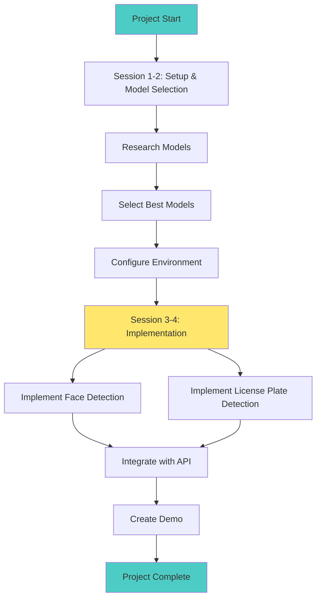
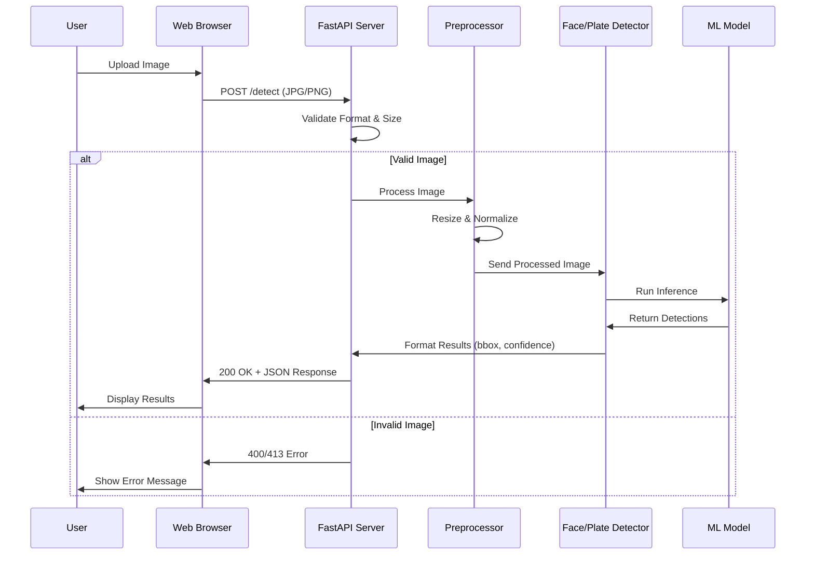

# PROCESSES

## 1. Project Overview

### Purpose
Proof of Concept (POC) to demonstrate automated face detection and license plate detection from images.

### Objectives
- [ ] Implement face detection from images with confidence scores
- [ ] Implement license plate detection
- [ ] Achieve >90% detection accuracy on test dataset
- [ ] Support JPG and PNG image formats

### Success Criteria
- [ ] Face detection accuracy ≥ 90%
- [ ] License plate detection accuracy ≥ 85%
- [ ] Working demo with sample images

### Timeline
- **Start Date**: October 20, 2025
- **Expected Completion**: 4 sessions
- **Milestones**:
  - Session 1-2: Setup and model selection
  - Session 3-4: Face and license plate detection implementation

---

## 2. Process Diagrams

### 2.1 Development Process Flow



### 2.2 Detection Request Sequence



---

## 3. Development Workflow

### Branch Strategy
- `main`: Stable code
- `develop`: Active development
- `feature/*`: New features (e.g., `feature/face-detection`)
- `bugfix/*`: Bug fixes

### Git Workflow
1. Create feature branch from `develop`
2. Make changes and commit regularly
3. Create Pull Request when ready
4. Get review and approval
5. Merge to `develop`
6. Merge `develop` to `main` for releases

### Commit Messages
Use clear, descriptive messages:
```
feat: add face detection with RetinaFace
fix: improve detection accuracy
docs: update setup instructions
```

---

## 4. Code Standards

### Style Guidelines
- **Python**: Follow PEP 8
- Use `black` for formatting
- Maximum line length: 100 characters
- Add docstrings for public functions
- Use type hints

### Project Structure
```
htw-emerging-photo/
├── src/
│   ├── detection/
│   │   ├── faces/
│   │   └── plates/
│   ├── api/
│   └── utils/
├── tests/
├── data/
│   ├── samples/
│   └── models/
├── docs/
└── requirements.txt
```

---

## 5. Testing

### Test Types
- **Unit Tests**: Test individual functions
- **Integration Tests**: Test complete detection flow
- **Visual Tests**: Compare results with expected outputs

### Running Tests
```bash
# Run all tests
pytest

# Run with coverage
pytest --cov=src

# Test specific module
pytest tests/test_face_detection.py
```

### Test Data
- Store test images in `tests/fixtures/`
- Include edge cases: poor lighting, angles, occlusions
- Document expected results

---

## 6. Model Development

### Model Selection Process
1. Research existing models (RetinaFace, YOLO, etc.)
2. Test candidates with sample images
3. Evaluate accuracy and speed
4. Document choice and rationale

### Evaluation Criteria
- Detection accuracy
- Processing speed
- Model size
- Ease of integration

### Recommended Models
- **Face Detection**: RetinaFace
- **License Plate Detection**: YOLO

---

## 7. Deployment

### Local Development
```bash
# Setup
python -m venv venv
source venv/bin/activate
pip install -r requirements.txt

# Run
python -m src.main
```

### Docker (Optional)
```bash
# Build
docker build -t photo-detection .

# Run
docker run -p 8000:8000 photo-detection
```

---

## 8. Security & Privacy

### Input Validation
- Only accept JPG and PNG files
- Limit file size (max 10MB)
- Validate image dimensions
- Sanitize filenames

### Privacy Considerations
- **Face Detection**: Handle personal data responsibly
- **License Plates**: Protect PII
- Don't store uploaded images by default

### Security Best Practices
- Never commit secrets or API keys
- Use environment variables for configuration
- Keep dependencies updated
- Scan for vulnerabilities regularly

---

## 9. Performance

### Performance Goals
- Handle multiple faces/plates in single image
- Efficient memory usage

### Optimization Tips
- Resize images to optimal dimensions
- Use optimized model formats (ONNX)
- Cache results when appropriate
- Profile and identify bottlenecks

---

## 10. Documentation

### Required Documentation
- **README.md**: Setup and usage instructions
- **PROCESSES.md**: This file
- **ARCHITECTURE.md**: System design
- **REQUIREMENTS.md**: Feature requirements
- Code comments for complex logic

### Keep Updated
- Update docs when changing features
- Document known limitations
- Add examples and screenshots
- Keep setup instructions current

---

## 11. Quality Checklist

### Definition of Done
- [ ] Code complete and tested
- [ ] Tests passing
- [ ] Accuracy meets targets
- [ ] Documentation updated
- [ ] Code reviewed
- [ ] No critical bugs

---

## Useful Commands

### Development
```bash
# Install dependencies
pip install -r requirements.txt

# Format code
black src/ tests/

# Run linter
flake8 src/

# Run tests
pytest

# Run with debug output
python -m src.main --debug
```

### Common Tasks
```bash
# Download models
python scripts/download_models.py

# Test with sample image
python scripts/test_detection.py --image data/samples/test.jpg

# Benchmark performance
python scripts/benchmark.py
```

---

## Technology Stack

### Core Technologies
- **Language**: Python 3.9+
- **Computer Vision**: OpenCV
- **Image Processing**: Pillow
- **Web Framework**: FastAPI (if building API)

### ML/Detection Libraries
- **Face Detection**: RetinaFace
- **License Plate**: YOLO

### Development Tools
- **Testing**: pytest
- **Formatting**: black
- **Linting**: flake8
- **Type Checking**: mypy

---

## Performance Targets

| Metric | Target | Status |
|--------|--------|--------|
| Face Detection Accuracy | > 90% | TBD |
| Plate Detection Accuracy | > 85% | TBD |

---

**Last Updated**: October 20, 2025  
**Version**: 1.0
