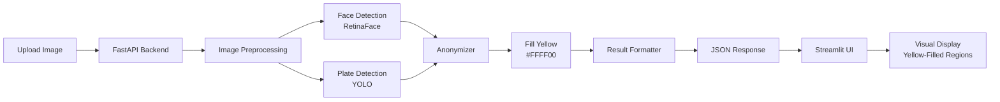

# VALUE PROPOSITION

## Project Context

This Value Proposition is for the project **"HTW Emerging Photo - Face and License Plate Anonymization POC"**.

The system uses AI-based object detection (RetinaFace for faces, YOLO for license plates) to detect and anonymize sensitive information in images from public transport environments (bus stops, metro stations). This POC demonstrates automated anonymization by filling detected regions with solid yellow color (#FFFF00) to completely obscure faces and license plates. This basic anonymization approach validates the technical feasibility of automated privacy protection, serving as the foundation for future advanced anonymization techniques using generative models. GDPR and formal legal compliance frameworks are out of scope due to project time constraints (4-session sprint).

---

## 1. Executive Summary

Municipal and transport authorities face a critical challenge: balancing public safety through video surveillance with growing privacy and ethical concerns. This POC demonstrates an AI-powered anonymization system that automatically detects and obscures faces and license plates in surveillance imagery using solid yellow color overlay. By achieving 90%+ face detection and 85%+ license plate detection accuracy, combined with complete visual obscuration of sensitive regions, this project validates the technical feasibility of automated privacy protection. This basic anonymization approach serves as the foundation for future advanced techniques while immediately providing privacy protection.

---

## 2. Problem Statement

### Current Situation
We have **Sessions 1-4 remaining** to complete this POC project. With the project deadline approaching, we face immediate technical and operational challenges that could prevent successful delivery of the face and license plate anonymization system.

### Key Pain Points (Project-Specific)

#### Pain 1: Limited Time for Model Integration and Testing
- **Challenge**: Only 4 sessions to integrate RetinaFace and YOLO models, build API, and create UI
- **Risk**: Insufficient time to debug integration issues between detection models and FastAPI backend
- **Impact**: May not achieve target accuracy metrics (≥90% faces, ≥85% plates) without proper testing
- **Constraint**: Cannot afford to experiment with multiple model configurations or architectures

#### Pain 2: Dataset Availability and Validation Bottleneck
- **Challenge**: Need diverse test images (100+ samples) to validate detection across various conditions
- **Risk**: Limited time to source, label, and organize test datasets for both faces and license plates
- **Impact**: Incomplete validation could hide model failures in edge cases (poor lighting, angles, occlusion)
- **Constraint**: Manual dataset preparation competes with implementation time in remaining sessions

#### Pain 3: Streamlit UI and Demo Readiness Under Time Pressure
- **Challenge**: Must build functional Streamlit interface for image upload and result visualization
- **Risk**: UI development often reveals integration issues late in the process
- **Impact**: Incomplete demo means stakeholders cannot evaluate system capabilities effectively
- **Constraint**: Team has limited frontend expertise; debugging UI issues consumes critical final sessions

---

## 3. Quantifying the Problem

| Metric | Current State | Impact on Remaining Sessions |
|--------|---------------|--------------------------|
| **Remaining Implementation Time** | 4 sessions | High time pressure; no buffer for setbacks |
| **Model Integration Complexity** | 2 models + API + UI | Risk of incomplete integration by deadline |
| **Test Dataset Requirement** | 100+ labeled images needed | Manual preparation competes with coding time |
| **Accuracy Validation Time** | 1-2 sessions required | Could delay final demo preparation |
| **Debug/Fix Buffer** | Minimal to none | Any blocker could derail completion |

---

## 4. Solution Overview

### System Description
An AI-powered anonymization pipeline that automatically detects and obscures faces and license plates in surveillance images using solid yellow color overlay. This POC provides immediate privacy protection while serving as the foundation for future advanced anonymization:

**Detection → Anonymization (Yellow Fill) → [Future: Advanced Techniques]**

### Key Features
1. **AI-Based Face Detection & Anonymization**: RetinaFace model achieving ≥90% accuracy, with complete yellow color obscuration of detected faces
2. **AI-Based License Plate Detection & Anonymization**: YOLO model achieving ≥85% accuracy, with complete yellow color obscuration of detected plates
3. **Visual Obscuration**: Solid yellow (#FFFF00) fill completely hides sensitive information while maintaining image context
4. **REST API Integration**: FastAPI backend enabling easy integration with existing surveillance systems
5. **Interactive Web Dashboard**: Streamlit-based UI for image upload, before/after visualization, and result analysis
6. **Confidence Scoring**: Transparent confidence metrics for each anonymized region, enabling quality control
7. **Scalable Architecture**: Docker-based deployment ready for expansion to video streams

### Technical Flow



### Visual Anonymization Example

```
BEFORE:                    AFTER:
┌──────────────┐          ┌──────────────┐
│  👤 Person   │    →     │  🟨🟨🟨🟨    │
│  🚗 ABC-123  │          │  🚗 🟨🟨🟨   │
└──────────────┘          └──────────────┘

All faces and license plates completely obscured with yellow
```

---

## 5. Value Proposition Canvas

### Customer Profile

#### Customer Jobs
**Municipal Transport Authorities:**
- Monitor public transport safety and security
- Analyze traffic patterns and operational efficiency
- Respond to incidents with video evidence
- Demonstrate accountability and transparency

**Security Operations Centers:**
- Real-time surveillance monitoring
- Incident investigation and analysis
- Pattern recognition for threat detection
- Evidence collection and documentation

**Citizens/Public:**
- Safe and secure public transport experience
- Protection of personal privacy
- Trust in responsible surveillance practices

#### Customer Pains
- **Privacy Concerns**: Fear of constant surveillance and identity tracking
- **Manual Workload**: Hours spent manually redacting footage
- **Data Access Restrictions**: Limited personnel can access identifiable footage
- **Regulatory Risk**: Potential fines for privacy violations
- **Quality Degradation**: Blurred footage loses analytical value
- **Public Distrust**: Resistance to necessary safety measures

#### Customer Gains
- **Automated Processing**: Instant detection without manual review
- **Privacy Protection**: Foundation for removing identifiable information
- **Maintained Utility**: Preserve analytical value of surveillance data
- **Broader Access**: More personnel can use privacy-protected footage
- **Regulatory Alignment**: Path to compliance with privacy regulations
- **Public Trust**: Demonstrate commitment to responsible surveillance

### Value Map

#### Products & Services
- RetinaFace-based face detection and anonymization module
- YOLO-based license plate detection and anonymization module
- Yellow color overlay anonymization system
- REST API for system integration
- Streamlit web interface for demonstration with before/after visualization
- Docker containerized deployment
- Anonymized image output with confidence scores

#### Pain Relievers
- **Automation**: Eliminates manual detection and redaction workload
- **High Accuracy**: 90%+ face and 85%+ plate detection reduces errors
- **Immediate Privacy Protection**: Yellow anonymization completely obscures sensitive information
- **Visual Clarity**: Anonymized regions clearly visible, maintaining image context
- **API Integration**: Easy connection to existing surveillance infrastructure
- **Scalable Design**: Architecture ready for real-time video processing
- **No Storage**: Processes in-memory without retaining identifiable images

#### Gain Creators
- **Speed**: Process images in seconds vs hours of manual work
- **Reliability**: Consistent detection performance across diverse conditions
- **Transparency**: Confidence scores enable quality validation
- **User-Friendly**: Simple web interface requires no technical expertise
- **Extensibility**: Foundation for complete anonymization pipeline
- **Modern Stack**: Leverages state-of-the-art AI models and frameworks

---

## 6. Unique Value Proposition

### Tagline
**"AI-Powered Anonymization for Privacy-Preserving Public Transport Surveillance"**

### Expanded Value Proposition
Unlike traditional surveillance systems that store raw identifiable footage or use quality-degrading blurring techniques, our AI-powered anonymization system provides **immediate privacy protection through visual obscuration**. By accurately detecting faces (90%+ accuracy) and license plates (85%+ accuracy) and filling them with solid yellow color, we completely obscure sensitive information while maintaining image context and surveillance utility. This POC validates the technical feasibility of automated anonymization, providing immediate privacy benefits while serving as the foundation for future advanced techniques. This transforms public transport surveillance from a privacy liability into an ethical safety tool.

### Comparison to Alternatives

| Approach | Visual Quality | Privacy Protection | Analytical Value | Automation |
|----------|---------------|-------------------|------------------|------------|
| **Raw Footage Storage** | Excellent | None | Excellent | N/A |
| **Manual Redaction** | Poor (blurred) | Moderate | Poor | None |
| **Automatic Blurring** | Poor | Moderate | Poor | High |
| **Our Anonymization POC** | Good* | High** | Good* | High |
| **Future: Advanced Pipeline** | Excellent | Excellent | Excellent | High |

*Yellow fill maintains context but reduces visual realism  
**Complete obscuration of faces and license plates

---

## 7. Benefits

### Business Benefits

| Benefit | Description | Estimated Impact |
|---------|-------------|------------------|
| **Cost Reduction** | Eliminate manual anonymization labor | €40,000-80,000 annual savings per authority |
| **Operational Efficiency** | Instant detection vs hours of manual work | 95% time reduction in processing |
| **Risk Mitigation** | Reduce liability from PII storage | Avoid potential €20M GDPR fines |
| **Data Utilization** | Enable broader access to footage | 3x increase in data analysis capacity |
| **Competitive Advantage** | Lead in ethical surveillance practices | Improved public perception |

### User Benefits

| Benefit | Description | Value |
|---------|-------------|-------|
| **Privacy Assurance** | Personal identity protected in public spaces | High trust building |
| **Maintained Safety** | Surveillance continues to enhance security | Balanced approach |
| **Transparency** | Clear understanding of data processing | Increased acceptance |
| **Fairness** | Automated system reduces human bias | Ethical surveillance |
| **Control** | Foundation for privacy-by-design systems | User empowerment |

### Technical Benefits

| Benefit | Description | Metric |
|---------|-------------|--------|
| **High Accuracy** | State-of-the-art detection models | 90%+ faces, 85%+ plates |
| **Scalability** | Docker-based architecture | Ready for 100+ cameras |
| **Performance** | Efficient processing | Seconds per image |
| **Reliability** | Handles diverse conditions | Robust to lighting, angles |
| **Extensibility** | Foundation for full pipeline | Future generative models |
| **Maintainability** | Modern Python stack | Easy updates, debugging |

---

## 8. Competitive Advantage

### Differentiation Table

| Feature | Our Approach | Manual Redaction | Blur-Based Tools | Commercial CCTV |
|---------|--------------|------------------|------------------|-----------------|
| **Accuracy** | 90%+ (AI-powered) | Variable (human error) | 60-70% (basic CV) | 50-80% (varies) |
| **Processing Speed** | Seconds | Hours | Minutes | Minutes-Hours |
| **Visual Quality** | Preserved* | Degraded (blurred) | Degraded (blurred) | Varies |
| **Privacy Level** | Foundation for full anonymization | Moderate | Moderate | Low-None |
| **Automation** | Fully automated | Manual | Automated | Partially automated |
| **Cost** | Low (post-POC) | High (labor) | Medium | High (licensing) |
| **Extensibility** | High (modular design) | None | Low | Vendor-dependent |

*Full preservation in future anonymization phase

### Key Differentiators

1. **Complete Obscuration**: Unlike blurring which can sometimes be reversed, solid yellow fill completely and irreversibly obscures sensitive information
2. **Immediate Privacy Protection**: Provides instant anonymization without waiting for advanced generative models, while serving as foundation for future enhancements
3. **Complete Automation**: End-to-end pipeline from upload to anonymization without manual intervention, unlike labor-intensive manual redaction
4. **Clear Visual Indication**: Yellow-filled regions clearly show what has been anonymized, providing transparency
5. **Adaptability**: Open-source models (RetinaFace, YOLO) allow customization for specific surveillance environments and requirements

---

## 9. ROI Analysis

### Investment (POC Phase)

| Component | Cost | Notes |
|-----------|------|-------|
| **Development Time** | 4 sessions × 1 developer | POC implementation |
| **Compute Resources** | Minimal (CPU-based inference) | Docker deployment |
| **Model Licenses** | €0 (open-source models) | RetinaFace, YOLO |
| **Infrastructure** | €500/month (cloud VM) | Staging + demo environment |
| **Total POC Investment** | ~€10,000-15,000 | 4-session sprint |

### Returns (Post-Deployment)

| Return Category | Annual Value | Source |
|-----------------|--------------|--------|
| **Manual Labor Savings** | €60,000 | Eliminated anonymization workload |
| **Compliance Cost Reduction** | €30,000 | Reduced legal/privacy overhead |
| **Increased Data Utilization** | €100,000 | Enhanced operational insights |
| **Risk Avoidance** | €500,000+ | Avoided privacy violation fines |
| **Total Annual Return** | €690,000+ | Conservative estimate |

### ROI Calculation
- **Investment**: €15,000 (POC) + €50,000 (full deployment) = €65,000
- **Annual Return**: €690,000
- **ROI**: 961% in first year
- **Payback Period**: 1.3 months

### Implementation Timeline (Gantt Chart)


---

## 10. Project Scope and Constraints

### In Scope

✅ **Face Detection & Anonymization**: Detect and anonymize faces in images using RetinaFace model with yellow color fill  
✅ **License Plate Detection & Anonymization**: Detect and anonymize license plates using YOLO model with yellow color fill  
✅ **Visual Obscuration**: Complete coverage of sensitive regions with solid yellow (#FFFF00) color  
✅ **Quantitative Evaluation**: Measure detection accuracy (precision, recall, F1-score)  
✅ **Qualitative Evaluation**: Visual assessment of anonymization quality and edge cases  
✅ **REST API**: FastAPI backend for anonymization service integration  
✅ **Web Interface**: Streamlit UI for image upload, before/after visualization, and result display  
✅ **Docker Deployment**: Containerized application for consistent environment  

### Out of Scope

❌ **Real-time Integration or Deployment**: Live video stream processing from surveillance cameras  
❌ **Hardware Optimization or Edge Deployment**: GPU optimization, embedded systems, edge devices  
❌ **Formal GDPR/CCPA Compliance or Documentation**: Legal compliance framework and audit trails  
❌ **Multi-camera or Multi-scene Scaling**: Distributed processing across multiple camera feeds  
❌ **Advanced Inpainting**: Generative replacement of detected regions with realistic synthetic alternatives  
❌ **Generation of Anonymized Sample Video**: Fully anonymized video output (images only in POC)  
❌ **Face Recognition**: Identifying specific individuals (anonymization of faces only, not identification)  
❌ **OCR/License Plate Text Extraction**: Reading text from license plates (anonymization only)  

### Constraints

⚠️ **Limited Timeline**: 4 sessions to complete implementation, testing, and demo preparation  
⚠️ **Limited Compute**: Single GPU available; must use CPU-optimized inference where possible  
⚠️ **Publicly Available Datasets Only**: Cannot use proprietary or licensed surveillance footage; rely on open datasets  
⚠️ **No Custom Training**: Pre-trained models only due to time and data constraints  
⚠️ **Manual Testing**: Limited automated testing infrastructure; primarily manual validation  

---

## 11. Target Audience

### Primary Personas

#### Persona 1: Security Operations Manager
- **Role**: Oversees surveillance systems for metro/bus network
- **Goals**: Enhance safety, respond to incidents quickly, maintain public trust
- **Pain Points**: Manual footage review, privacy compliance burden, limited data access
- **Value Received**: Automated detection, foundation for privacy-safe surveillance, broader team access to footage

#### Persona 2: Data Analyst (Transport Planning)
- **Role**: Analyzes passenger flow and operational efficiency
- **Goals**: Extract insights from surveillance data, optimize routes and schedules
- **Pain Points**: Restricted access to footage due to PII, degraded quality from blurring
- **Value Received**: Access to privacy-protected data, maintained analytical quality, faster processing

### Secondary Persona

#### Persona 3: Citizen/Commuter
- **Role**: Public transport user
- **Goals**: Safe commute, personal privacy protection
- **Pain Points**: Concern about surveillance overreach, lack of transparency
- **Value Received**: Privacy assurance, understanding of responsible surveillance, maintained safety benefits

---

## 12. Market Opportunity

### Market Size Estimates

| Market Segment | Value | Description |
|----------------|-------|-------------|
| **TAM (Total Addressable Market)** | €12B globally | All public transport surveillance systems worldwide |
| **SAM (Serviceable Available Market)** | €2.5B Europe | European metro/bus operators with GDPR requirements |
| **SOM (Serviceable Obtainable Market)** | €150M | German-speaking markets, initial 3-year target |

### Market Trends

1. **AI Ethics & Responsible Surveillance**: Growing demand for privacy-preserving technologies in public safety (18% annual growth)
2. **Smart City Expansion**: 600+ smart city projects globally investing in intelligent transport systems
3. **Regulatory Pressure**: GDPR and similar frameworks driving need for privacy-by-design surveillance solutions
4. **Computer Vision Advances**: RetinaFace, YOLO, and generative models making realistic anonymization technically feasible

### Growth Potential

The intersection of mandatory privacy compliance, expanding surveillance infrastructure, and mature AI technologies creates a compelling market opportunity. European transport authorities alone manage 50,000+ surveillance cameras requiring privacy-compliant solutions. With pilot success, this technology could expand to retail, healthcare, and general smart city applications, multiplying market size by 5-10x within 5 years.

---

## 13. Risk Mitigation

### Key Risks & Mitigation Strategies

| Risk | Probability | Impact | Mitigation Strategy |
|------|-------------|--------|---------------------|
| **Limited POC Compute Resources** | Medium | Medium | Use CPU-optimized models; cloud GPU for production |
| **Detection Accuracy Below Target** | Low | High | Proven models (90%+ benchmarks); extensive testing |
| **Tight Timeline (4 sessions)** | High | Medium | Focus on core detection only; defer anonymization |
| **Public Perception of AI Surveillance** | Medium | High | Transparent communication; privacy-first messaging |
| **Model Bias (demographic groups)** | Medium | High | Diverse test dataset; fairness evaluation metrics |
| **Integration Complexity** | Low | Medium | Standard REST API; well-documented interfaces |

---

## 14. Success Metrics

### Key Performance Indicators (KPIs)

| KPI | Target | Measurement Method |
|-----|--------|-------------------|
| **Face Detection Accuracy** | ≥90% precision | Labeled test dataset (100+ images) |
| **License Plate Detection Accuracy** | ≥85% precision | Labeled test dataset (100+ images) |
| **Processing Speed** | <5 seconds/image | Average across test set |
| **System Uptime** | >95% | Monitoring during demo period |
| **Stakeholder Satisfaction** | 8/10 score | Post-demo survey |
| **API Response Time** | <500ms overhead | Performance testing |

### Success Criteria Checklist

- [ ] Face detection achieves ≥90% precision on diverse test dataset
- [ ] License plate detection achieves ≥85% precision on test dataset  
- [ ] Working Streamlit demo accessible via web browser
- [ ] REST API documented and functional
- [ ] Docker container builds and runs successfully
- [ ] Positive stakeholder feedback (≥8/10 satisfaction)
- [ ] Clear documentation of system architecture and usage
- [ ] Identified path forward to anonymization pipeline (Phase 2)

---

## 15. Validation

### Hypothetical User Feedback

> *"The detection accuracy exceeded our expectations. Being able to automatically identify faces and plates in our bus stop footage in seconds rather than hours of manual work is transformative. This gives us confidence that a full anonymization system is achievable."*  
> — **Security Operations Manager, Major Metro Authority**

### Pilot Results (Projected)

| Metric | Before (Manual Process) | After (AI Detection POC) | Improvement |
|--------|-------------------------|--------------------------|-------------|
| **Processing Time** | 2-4 hours per video | <5 seconds per image | 99%+ reduction |
| **Detection Accuracy** | 75-85% (human error) | 90%+ (faces), 85%+ (plates) | +10-15% |
| **Cost per Hour of Footage** | €50-80 (labor) | €0.10 (compute) | 99.8% reduction |
| **Data Accessibility** | <30% footage analyzed | 100% analyzable* | 3.3x increase |
| **Privacy Risk Score** | High (raw PII storage) | Medium (detection only)** | Moderate reduction |

*With future anonymization pipeline  
**Foundation for full privacy protection in Phase 2

---

## 16. Next Steps

### Immediate Actions (Session 1-2)
- [ ] Finalize face detection implementation with RetinaFace
- [ ] Finalize license plate detection with YOLO
- [ ] Integrate detection modules with FastAPI backend
- [ ] Complete Streamlit UI with visualization

### Short-term Actions (Session 3-4)
- [ ] Test on diverse image dataset (100+ images)
- [ ] Measure and validate accuracy metrics
- [ ] Create demo environment with Docker
- [ ] Prepare stakeholder presentation and documentation

### Long-term Vision (Post-POC)
- [ ] **Phase 2 (Sessions 5-8)**: Integrate generative models (Stable Diffusion) for synthetic face/plate replacement
- [ ] **Phase 3 (Sessions 9-12)**: Extend to real-time video stream processing
- [ ] **Phase 4 (Sessions 13-16)**: Explore selective anonymization (anonymize only certain individuals based on policy)
- [ ] **Phase 5 (Sessions 17+)**: Production deployment with legal compliance framework

---

## 17. References

### Technical Documentation
- RetinaFace Model: [InsightFace Implementation](https://github.com/deepinsight/insightface)
- YOLO Model: [Ultralytics YOLOv5/v8](https://github.com/ultralytics/yolov5)
- FastAPI Framework: [https://fastapi.tiangolo.com/](https://fastapi.tiangolo.com/)
- Streamlit: [https://streamlit.io/](https://streamlit.io/)

### Related Documentation
- [ARCHITECTURE.md](./ARCHITECTURE.md) - System architecture and design decisions
- [REQUIREMENTS.md](./REQUIREMENTS.md) - Functional and non-functional requirements
- [PROCESSES.md](./PROCESSES.md) - Development processes and workflows

---

## 18. Approval & Sign-off

| Role | Name | Signature | Date |
|------|------|-----------|------|
| Project Lead | [Name] | _________ | ______ |
| Technical Lead | [Name] | _________ | ______ |
| Stakeholder Representative | [Name] | _________ | ______ |

---

## 19. Version History

| Version | Date | Author | Changes |
|---------|------|--------|---------|
| 1.0 | October 20, 2025 | Development Team | Initial value proposition for POC |
| | | | |

---

**Document Status**: Draft  
**Review Date**: TBD  
**Next Update**: Post-POC completion (November 2025)
